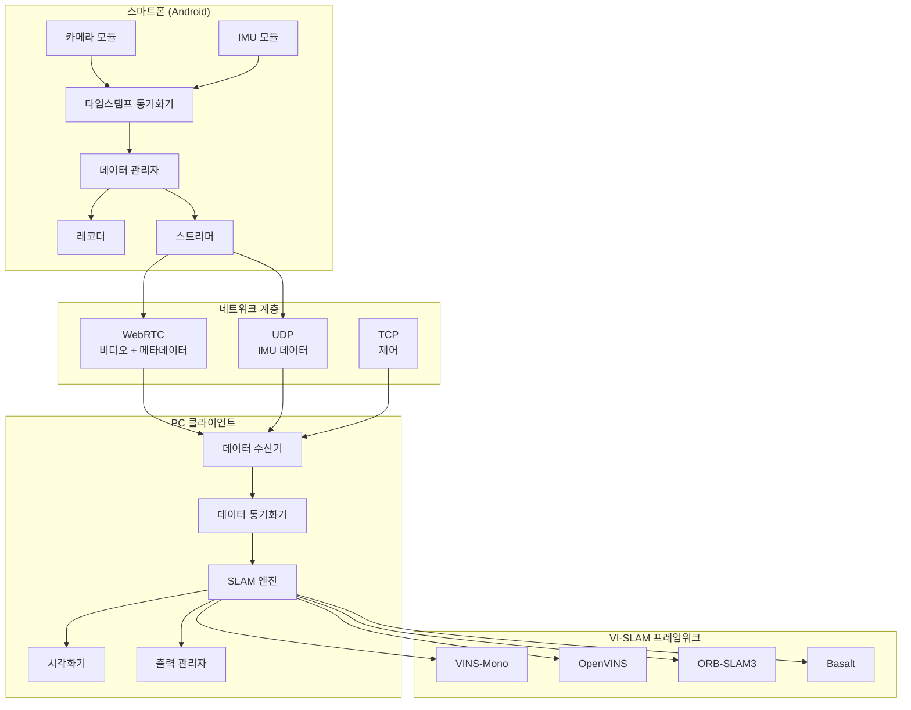
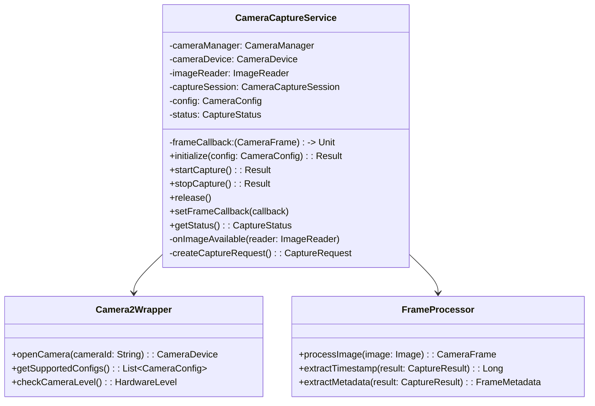
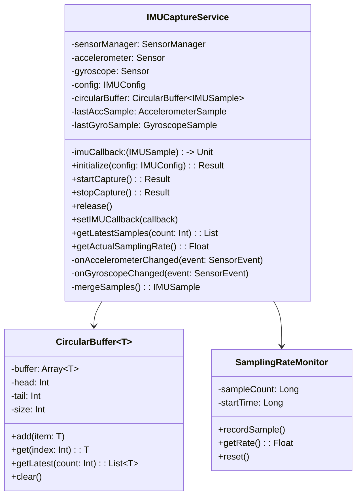
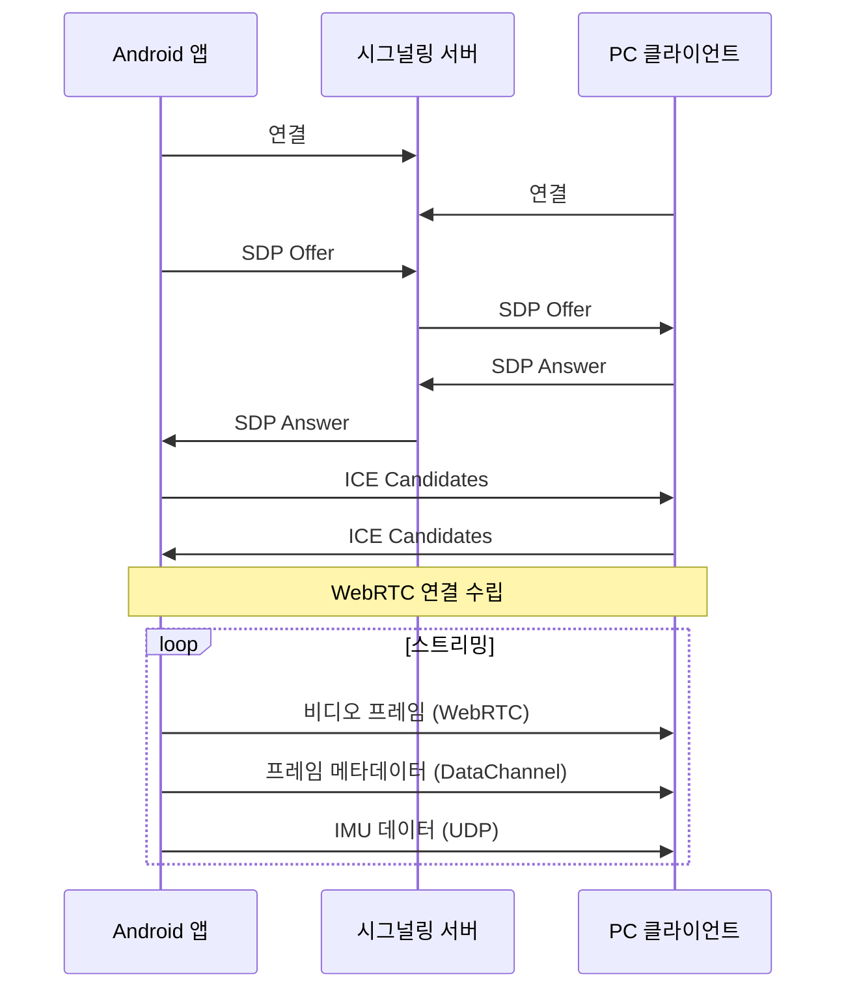
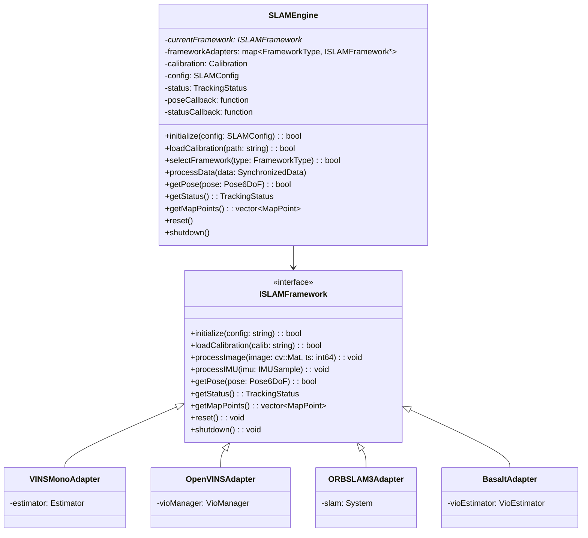
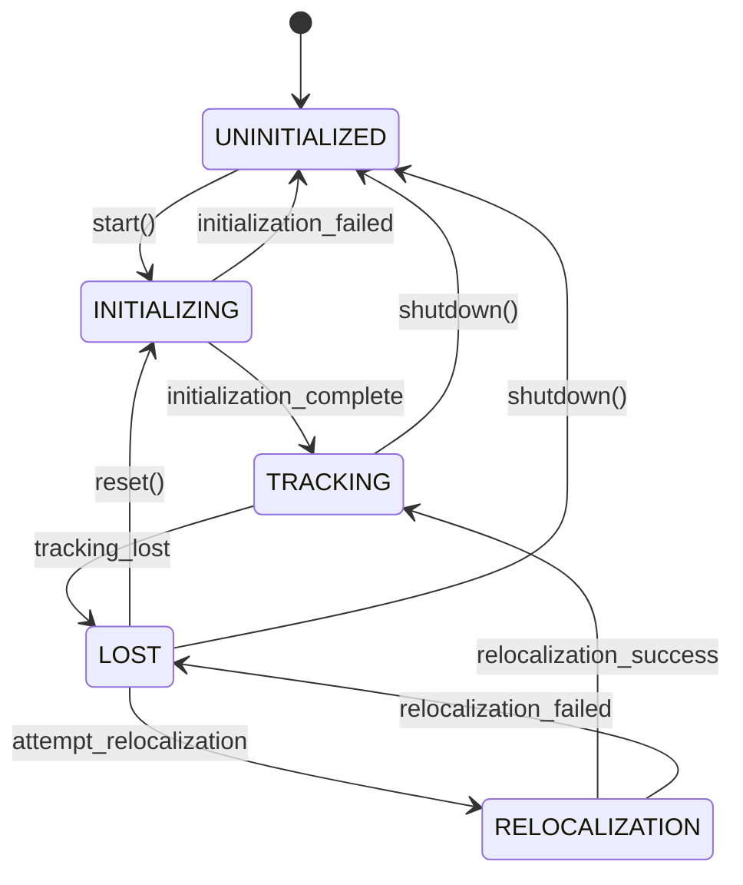
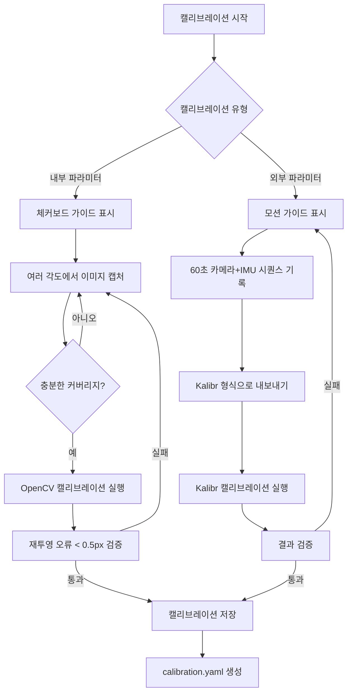
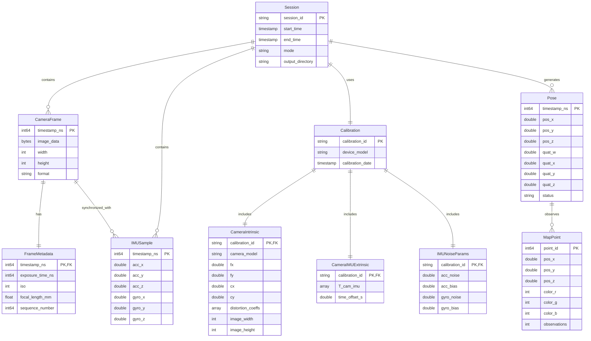
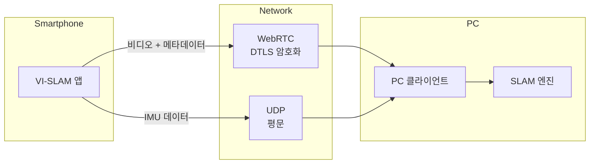
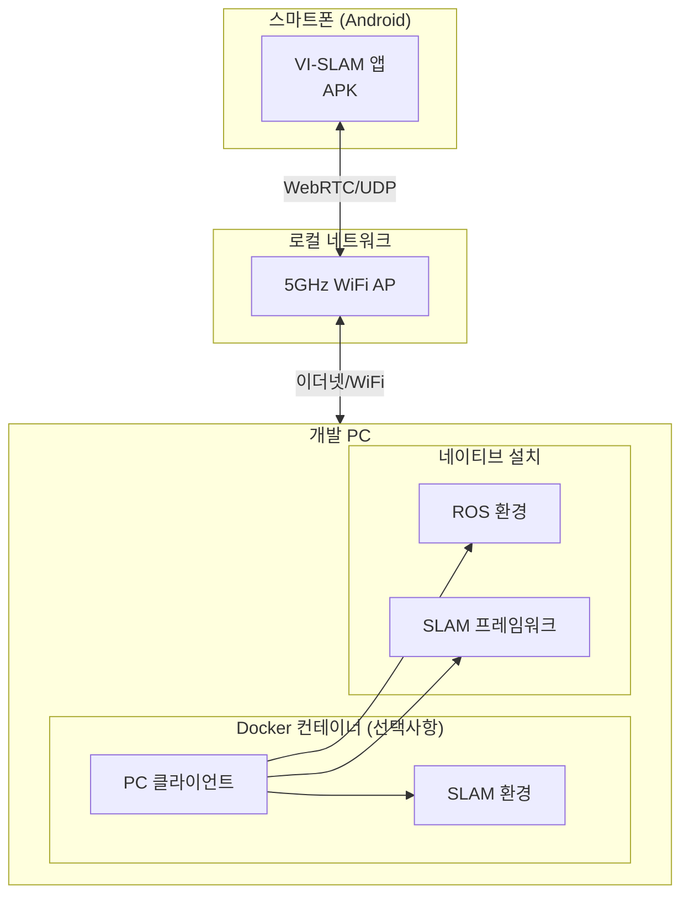

# 소프트웨어 설계 명세서 (Software Design Specification, SDS)
# VI-SLAM: 스마트폰 비주얼-관성 SLAM 시스템

---

| 항목 | 값 |
|------|-----|
| 문서 ID | SDS-VISLAM-001 |
| 출처 SRS | SRS-VISLAM-001 |
| 버전 | 1.0.0 |
| 상태 | 초안 (Draft) |
| 작성일 | 2026-01-24 |
| 작성자 | VI-SLAM 프로젝트 팀 |

---

## 목차

1. [소개](#1-소개)
2. [시스템 아키텍처](#2-시스템-아키텍처)
3. [컴포넌트 설계](#3-컴포넌트-설계)
4. [데이터 설계](#4-데이터-설계)
5. [인터페이스 설계](#5-인터페이스-설계)
6. [보안 설계](#6-보안-설계)
7. [배포 아키텍처](#7-배포-아키텍처)
8. [추적성 매트릭스](#8-추적성-매트릭스)
9. [부록](#9-부록)

---

## 1. 소개

### 1.1 목적

본 소프트웨어 설계 명세서(SDS)는 VI-SLAM 시스템의 종합적인 기술 설계를 제공합니다. 소프트웨어 요구사항 명세서(SRS-VISLAM-001)에 정의된 요구사항을 구현 단계를 안내할 상세한 아키텍처 및 컴포넌트 설계로 변환합니다.

본 문서는 다음을 위한 주요 기술 참조 자료로 사용됩니다:
- 시스템 컴포넌트를 구현하는 개발팀 구성원
- 시스템 설계 결정을 검토하는 아키텍트
- 테스트 전략을 개발하는 QA 엔지니어
- 배포 인프라를 계획하는 DevOps 엔지니어

### 1.2 범위

본 SDS는 다음을 포함한 VI-SLAM 시스템의 전체 설계를 다룹니다:

- **안드로이드 모바일 애플리케이션**: 센서 데이터 캡처 및 스트리밍
- **PC 클라이언트 애플리케이션**: 데이터 수신, SLAM 처리 및 시각화
- **통신 계층**: WebRTC 및 UDP 기반 실시간 데이터 전송
- **VI-SLAM 프레임워크 어댑터**: VINS-Mono, OpenVINS, ORB-SLAM3, Basalt 통합
- **출력 모듈**: 궤적 내보내기, 포인트 클라우드 생성 및 실시간 API
- **캘리브레이션 모듈**: 카메라 내부 파라미터 및 카메라-IMU 외부 파라미터 캘리브레이션

### 1.3 설계 목표

| 목표 ID | 설계 목표 | 근거 |
|---------|-----------|------|
| DG-001 | 모듈성 (Modularity) | 컴포넌트의 독립적인 개발 및 테스트 가능 |
| DG-002 | 확장성 (Extensibility) | 핵심 변경 없이 새로운 SLAM 프레임워크 추가 지원 |
| DG-003 | 성능 (Performance) | 실시간 운영을 위한 100ms 미만의 종단간 지연 달성 |
| DG-004 | 신뢰성 (Reliability) | 30분 연속 세션 동안 99% 가동 시간 보장 |
| DG-005 | 유지보수성 (Maintainability) | 명확한 인터페이스와 포괄적인 문서 제공 |
| DG-006 | 테스트 가능성 (Testability) | 단위 및 통합 테스트를 위한 컴포넌트 설계 |

### 1.4 참조 문서

| 문서 | 설명 |
|------|------|
| SRS-VISLAM-001 | 소프트웨어 요구사항 명세서 |
| PRD-VISLAM-001 | 제품 요구사항 문서 |
| 01_vi_slam_overview.md | VI-SLAM 기술 개요 |
| 03_streaming_protocols.md | 스트리밍 프로토콜 분석 |
| 05_vislam_frameworks.md | 프레임워크 비교 |
| 06_android_camera2_api.md | Android Camera2 API 참조 |
| 09_timestamp_synchronization.md | 타임스탬프 동기화 기법 |

---

## 2. 시스템 아키텍처

### 2.1 아키텍처 개요

VI-SLAM 시스템은 스마트폰이 센서 허브 및 데이터 송신기 역할을 하고 PC가 처리 서버 역할을 하는 **분산 클라이언트-서버 아키텍처**를 따릅니다.



### 2.2 아키텍처 패턴

| 패턴 | 적용 영역 | 근거 |
|------|-----------|------|
| **클라이언트-서버 (Client-Server)** | 스마트폰-PC 통신 | 계산 집약적 SLAM을 PC로 오프로드 |
| **어댑터 (Adapter)** | VI-SLAM 프레임워크 통합 | 여러 프레임워크를 위한 통일된 인터페이스 |
| **옵저버 (Observer)** | Pose/상태 업데이트 | SLAM 엔진과 소비자 분리 |
| **생산자-소비자 (Producer-Consumer)** | 데이터 스트리밍 파이프라인 | 센서 간 속도 차이 처리 |
| **전략 (Strategy)** | 출력 형식 선택 | 다중 내보내기 형식 지원 |
| **파사드 (Facade)** | 캘리브레이션 모듈 | 복잡한 캘리브레이션 절차 단순화 |

### 2.3 기술 스택

| 계층 | 기술 | 버전 | 근거 |
|------|------|------|------|
| **Android 앱** | Kotlin | 1.9+ | 현대적 안드로이드 개발, 코루틴 지원 |
| **Android SDK** | Camera2 API | API 26+ | 타임스탬프 포함 직접 센서 접근 |
| **Android 스트리밍** | Google WebRTC | M100+ | 산업 표준 실시간 통신 |
| **PC 클라이언트** | Python | 3.8+ | 빠른 개발, 풍부한 라이브러리 |
| **PC 네이티브** | C++ | C++17 | 성능이 중요한 SLAM 처리 |
| **빌드 시스템** | CMake | 3.16+ | 크로스 플랫폼 C++ 빌드 |
| **컴퓨터 비전** | OpenCV | 4.5+ | 이미지 처리 및 시각화 |
| **선형 대수** | Eigen3 | 3.3+ | 효율적인 행렬 연산 |
| **최적화** | Ceres Solver | 2.0+ | 비선형 최소제곱 최적화 |
| **ROS 통합** | ROS Noetic/Humble | - | 로봇 생태계 통합 |
| **메시지 큐** | ZeroMQ | 4.3+ | 고성능 메시징 |

### 2.4 계층 아키텍처

```
+------------------------------------------------------------------+
|                        프레젠테이션 계층                           |
|  +----------------+  +----------------+  +--------------------+   |
|  | Android UI     |  | PC GUI         |  | RViz/시각화        |   |
|  | (Jetpack)      |  | (Qt/PyQt)      |  |                    |   |
|  +----------------+  +----------------+  +--------------------+   |
+------------------------------------------------------------------+
|                        애플리케이션 계층                           |
|  +----------------+  +----------------+  +--------------------+   |
|  | 캡처           |  | SLAM           |  | 내보내기           |   |
|  | 컨트롤러       |  | 컨트롤러       |  | 컨트롤러           |   |
|  +----------------+  +----------------+  +--------------------+   |
+------------------------------------------------------------------+
|                         도메인 계층                                |
|  +----------------+  +----------------+  +--------------------+   |
|  | 센서 데이터    |  | SLAM           |  | 캘리브레이션       |   |
|  | 처리           |  | 처리           |  | 처리               |   |
|  +----------------+  +----------------+  +--------------------+   |
+------------------------------------------------------------------+
|                      인프라스트럭처 계층                           |
|  +----------------+  +----------------+  +--------------------+   |
|  | Camera2/       |  | WebRTC/UDP     |  | 파일 시스템/       |   |
|  | SensorManager  |  | 네트워크       |  | 스토리지           |   |
|  +----------------+  +----------------+  +--------------------+   |
+------------------------------------------------------------------+
```

---

## 3. 컴포넌트 설계

### CMP-001: 카메라 캡처 모듈 (Camera Capture Module)

**출처 기능**: SF-001
**책임**: 정확한 타임스탬프로 스마트폰 후면 카메라에서 프레임 캡처
**유형**: service

#### 3.1.1 인터페이스 정의

```kotlin
interface ICameraCapture {
    fun initialize(config: CameraConfig): Result<Unit>
    fun startCapture(): Result<Unit>
    fun stopCapture(): Result<Unit>
    fun release(): Unit

    fun setFrameCallback(callback: (CameraFrame) -> Unit)
    fun getStatus(): CaptureStatus
    fun getSupportedConfigurations(): List<CameraConfig>
}

data class CameraConfig(
    val resolution: Resolution,
    val fps: Int,
    val format: ImageFormat,
    val exposureMode: ExposureMode
)

data class CameraFrame(
    val timestampNs: Long,
    val image: ByteArray,
    val width: Int,
    val height: Int,
    val format: ImageFormat,
    val metadata: FrameMetadata
)

data class FrameMetadata(
    val exposureTimeNs: Long,
    val iso: Int,
    val focalLengthMm: Float,
    val sequenceNumber: Long
)

enum class CaptureStatus {
    UNINITIALIZED, READY, CAPTURING, ERROR
}
```

#### 3.1.2 클래스 다이어그램



#### 3.1.3 의존성

- **내부**: 타임스탬프 동기화기 (CMP-003)
- **외부**: Android Camera2 API, Kotlin Coroutines

#### 3.1.4 오류 처리

| 오류 코드 | 조건 | 처리 방법 |
|-----------|------|-----------|
| CAM_E001 | 카메라 장치 사용 불가 | 1초 간격으로 3회 재시도 후 사용자에게 알림 |
| CAM_E002 | 권한 부족 | 사용자에게 권한 요청 프롬프트 |
| CAM_E003 | 카메라 연결 해제됨 | 리소스 해제, 재연결 옵션 제공 |
| CAM_E004 | 메모리 압박 | 버퍼 크기 축소, 경고 로깅 |
| CAM_E005 | 프레임 드롭 감지 | 이벤트 로깅, 캡처 계속 |

#### 3.1.5 구현 노트

- 정확한 프레임 타이밍을 위해 `SENSOR_TIMESTAMP` 사용
- 프레임 드롭 방지를 위한 더블 버퍼링 구현
- YUV_420_888 및 JPEG 형식 모두 지원
- 카메라 인터럽트(전화 등) 우아하게 처리

---

### CMP-002: IMU 캡처 모듈 (IMU Capture Module)

**출처 기능**: SF-002
**책임**: 고주파수로 가속도계 및 자이로스코프 데이터 캡처
**유형**: service

#### 3.2.1 인터페이스 정의

```kotlin
interface IIMUCapture {
    fun initialize(config: IMUConfig): Result<Unit>
    fun startCapture(): Result<Unit>
    fun stopCapture(): Result<Unit>
    fun release(): Unit

    fun setIMUCallback(callback: (IMUSample) -> Unit)
    fun getLatestSamples(count: Int): List<IMUSample>
    fun getStatus(): CaptureStatus
    fun getActualSamplingRate(): Float
}

data class IMUConfig(
    val targetRateHz: Int,
    val sensorType: IMUSensorType,
    val bufferSize: Int
)

data class IMUSample(
    val timestampNs: Long,
    val accX: Double,  // m/s^2
    val accY: Double,
    val accZ: Double,
    val gyroX: Double, // rad/s
    val gyroY: Double,
    val gyroZ: Double
)

enum class IMUSensorType {
    CALIBRATED,
    UNCALIBRATED
}
```

#### 3.2.2 클래스 다이어그램



#### 3.2.3 의존성

- **내부**: 타임스탬프 동기화기 (CMP-003)
- **외부**: Android SensorManager API

#### 3.2.4 오류 처리

| 오류 코드 | 조건 | 처리 방법 |
|-----------|------|-----------|
| IMU_E001 | 센서 사용 불가 | 사용자에게 알림, 기능 비활성화 |
| IMU_E002 | 샘플링 레이트 최소값 미만 | 사용자 경고, 보간 사용 |
| IMU_E003 | 버퍼 오버플로우 | 가장 오래된 샘플 삭제, 경고 로깅 |
| IMU_E004 | 잘못된 센서 데이터 | 샘플 폐기, 이상 로깅 |
| IMU_E005 | 타임스탬프 불연속 | 시간 참조 재보정 |

#### 3.2.5 구현 노트

- 최대 샘플링 레이트를 위해 `SENSOR_DELAY_FASTEST` 사용
- 가속도계와 자이로스코프 결합을 위한 센서 융합 구현
- 500Hz에서 5초 분량의 데이터를 위한 순환 버퍼 유지
- 실제 vs. 목표 샘플링 레이트 모니터링

---

### CMP-003: 타임스탬프 동기화기 (Timestamp Synchronizer)

**출처 기능**: SF-003
**책임**: 카메라와 IMU 타임스탬프를 통합 타임라인으로 정렬
**유형**: service

#### 3.3.1 인터페이스 정의

```kotlin
interface ITimestampSynchronizer {
    fun initialize(): Result<Unit>
    fun synchronize(frame: CameraFrame, imuBuffer: List<IMUSample>): SynchronizedData
    fun getInterpolatedIMU(timestampNs: Long): IMUSample?
    fun getIMUSamplesBetween(startNs: Long, endNs: Long): List<IMUSample>
    fun getTimeOffset(): Long
    fun getSyncStatus(): SyncStatus
}

data class SynchronizedData(
    val frame: CameraFrame,
    val interpolatedIMU: IMUSample,
    val imuSamplesBetweenFrames: List<IMUSample>,
    val syncQuality: SyncQuality
)

enum class SyncQuality {
    EXCELLENT,  // < 1ms 갭
    GOOD,       // 1-5ms 갭
    FAIR,       // 5-20ms 갭
    POOR        // > 20ms 갭
}

enum class SyncStatus {
    SYNCED, DRIFT_DETECTED, LOST
}
```

#### 3.3.2 동기화 알고리즘

```
알고리즘: 카메라-IMU 타임스탬프 정렬

입력: 타임스탬프 T_cam을 가진 CameraFrame, IMU 순환 버퍼
출력: SynchronizedData

1. T_cam을 둘러싸는 IMU 샘플 찾기:
   - T_imu_before = max(T_imu | T_imu <= T_cam)
   - T_imu_after = min(T_imu | T_imu > T_cam)

2. 갭 (T_imu_after - T_imu_before) > 50ms인 경우:
   - POOR 품질로 표시
   - 보간 대신 최근접 이웃 사용

3. 보간 비율 계산:
   - ratio = (T_cam - T_imu_before) / (T_imu_after - T_imu_before)

4. T_cam에서 IMU에 대한 선형 보간:
   - acc_interp = acc_before + ratio * (acc_after - acc_before)
   - gyro_interp = gyro_before + ratio * (gyro_after - gyro_before)

5. 이전 프레임 이후의 모든 IMU 샘플 수집

6. SynchronizedData 반환
```

#### 3.3.3 의존성

- **내부**: 카메라 캡처 (CMP-001), IMU 캡처 (CMP-002)
- **외부**: 없음

---

### CMP-004: 데이터 관리자 (Data Manager)

**출처 기능**: SF-004, SF-005
**책임**: 캡처, 저장 및 스트리밍 간의 데이터 흐름 조정
**유형**: controller

#### 3.4.1 인터페이스 정의

```kotlin
interface IDataManager {
    fun initialize(): Result<Unit>
    fun startSession(mode: SessionMode): Result<SessionInfo>
    fun stopSession(): Result<SessionSummary>

    fun getSessionStatus(): SessionStatus
    fun getStatistics(): SessionStatistics

    fun setRecorderEnabled(enabled: Boolean)
    fun setStreamerEnabled(enabled: Boolean)
}

enum class SessionMode {
    RECORD_ONLY,
    STREAM_ONLY,
    RECORD_AND_STREAM
}

data class SessionInfo(
    val sessionId: String,
    val startTime: Long,
    val mode: SessionMode,
    val outputDirectory: String?
)

data class SessionStatistics(
    val frameCount: Long,
    val imuSampleCount: Long,
    val durationMs: Long,
    val frameDropCount: Long,
    val averageFps: Float,
    val averageImuRate: Float
)
```

#### 3.4.2 의존성

- **내부**: 카메라 (CMP-001), IMU (CMP-002), 동기화 (CMP-003), 레코더 (CMP-005), 스트리머 (CMP-006)
- **외부**: 없음

---

### CMP-005: 레코더 모듈 (Recorder Module)

**출처 기능**: SF-004
**책임**: 비디오 및 IMU 데이터를 적절한 형식으로 로컬에 저장
**유형**: service

#### 3.5.1 인터페이스 정의

```kotlin
interface IRecorder {
    fun initialize(config: RecorderConfig): Result<Unit>
    fun startRecording(outputDir: String): Result<Unit>
    fun stopRecording(): Result<RecordingSummary>

    fun onData(data: SynchronizedData)
    fun getStatus(): RecordingStatus
    fun getStorageInfo(): StorageInfo
}

data class RecorderConfig(
    val videoCodec: VideoCodec,
    val videoQuality: VideoQuality,
    val imuFormat: IMUFormat,
    val generateMetadata: Boolean
)

data class RecordingSummary(
    val videoFile: String,
    val imuFile: String,
    val metadataFile: String,
    val frameCount: Long,
    val imuSampleCount: Long,
    val durationMs: Long,
    val fileSizeBytes: Long,
    val checksumValid: Boolean
)

enum class VideoCodec { H264, H265 }
enum class IMUFormat { CSV, BINARY }
```

#### 3.5.2 출력 파일 구조

```
session_20260124_100000/
├── video.mp4           # H.264 인코딩 비디오
├── imu.csv             # 타임스탬프가 포함된 IMU 데이터
├── metadata.json       # 세션 메타데이터
├── frames/             # (선택사항) 개별 프레임
│   ├── frame_000001.jpg
│   └── ...
└── checksums.sha256    # 데이터 무결성 검증
```

#### 3.5.3 의존성

- **내부**: 데이터 관리자 (CMP-004)
- **외부**: Android MediaCodec, 파일 시스템

---

### CMP-006: 스트리머 모듈 (Streamer Module)

**출처 기능**: SF-005
**책임**: 카메라 및 IMU 데이터를 실시간으로 PC에 스트리밍
**유형**: service

#### 3.6.1 인터페이스 정의

```kotlin
interface IStreamer {
    fun initialize(config: StreamerConfig): Result<Unit>
    fun connect(serverAddress: String): Result<Unit>
    fun disconnect(): Result<Unit>

    fun startStreaming(): Result<Unit>
    fun stopStreaming(): Result<Unit>

    fun onData(data: SynchronizedData)
    fun getConnectionStatus(): ConnectionStatus
    fun getStreamingStatistics(): StreamingStatistics
}

data class StreamerConfig(
    val webrtcPort: Int,
    val udpPort: Int,
    val videoBitrate: Int,
    val adaptiveBitrate: Boolean
)

data class StreamingStatistics(
    val bytesSent: Long,
    val framesSent: Long,
    val imuPacketsSent: Long,
    val packetLossRate: Float,
    val averageLatencyMs: Float,
    val currentBitrate: Int
)

enum class ConnectionStatus {
    DISCONNECTED, CONNECTING, CONNECTED, RECONNECTING, ERROR
}
```

#### 3.6.2 스트리밍 아키텍처



#### 3.6.3 의존성

- **내부**: 데이터 관리자 (CMP-004)
- **외부**: Google WebRTC, UDP 소켓

#### 3.6.4 프로토콜 상세

**WebRTC 데이터 채널 메시지 형식:**

```json
{
    "type": "frame_metadata",
    "timestamp_ns": 1234567890123456789,
    "sequence": 12345,
    "exposure_ns": 8333333,
    "iso": 100,
    "sync_quality": "EXCELLENT"
}
```

**UDP IMU 패킷 형식 (56 바이트):**

| 오프셋 | 크기 | 타입 | 필드 |
|--------|------|------|------|
| 0 | 8 | int64 | timestamp_ns |
| 8 | 8 | double | acc_x (m/s^2) |
| 16 | 8 | double | acc_y |
| 24 | 8 | double | acc_z |
| 32 | 8 | double | gyro_x (rad/s) |
| 40 | 8 | double | gyro_y |
| 48 | 8 | double | gyro_z |

---

### CMP-007: PC 데이터 수신기 (PC Data Receiver)

**출처 기능**: SF-006
**책임**: 스마트폰에서 비디오/IMU 데이터를 수신하고 디코딩
**유형**: service

#### 3.7.1 인터페이스 정의

```cpp
class IDataReceiver {
public:
    virtual ~IDataReceiver() = default;

    virtual bool initialize(const ReceiverConfig& config) = 0;
    virtual bool startListening() = 0;
    virtual bool stopListening() = 0;

    virtual void setFrameCallback(std::function<void(const DecodedFrame&)> callback) = 0;
    virtual void setIMUCallback(std::function<void(const IMUSample&)> callback) = 0;

    virtual ConnectionStatus getStatus() const = 0;
    virtual ReceiverStatistics getStatistics() const = 0;
};

struct ReceiverConfig {
    int webrtcPort;
    int udpPort;
    int tcpControlPort;
    int bufferSizeMs;
};

struct DecodedFrame {
    int64_t timestampNs;
    cv::Mat image;
    FrameMetadata metadata;
};

struct ReceiverStatistics {
    int64_t bytesReceived;
    int64_t framesReceived;
    int64_t imuPacketsReceived;
    float packetLossRate;
    float averageLatencyMs;
    int bufferUtilization;
};
```

#### 3.7.2 의존성

- **내부**: 데이터 동기화기 (CMP-008)
- **외부**: aiortc (Python WebRTC), FFmpeg, OpenCV

---

### CMP-008: PC 데이터 동기화기 (PC Data Synchronizer)

**출처 기능**: SF-003, SF-006
**책임**: PC 측에서 수신된 비디오 및 IMU 데이터 동기화
**유형**: service

#### 3.8.1 인터페이스 정의

```cpp
class IDataSynchronizer {
public:
    virtual ~IDataSynchronizer() = default;

    virtual bool initialize(const SyncConfig& config) = 0;
    virtual void addFrame(const DecodedFrame& frame) = 0;
    virtual void addIMU(const IMUSample& sample) = 0;

    virtual void setSynchronizedDataCallback(
        std::function<void(const SynchronizedData&)> callback) = 0;

    virtual SyncStatus getStatus() const = 0;
    virtual int64_t getEstimatedOffset() const = 0;
};

struct SyncConfig {
    int64_t maxTimeDifferenceNs;
    int imuBufferSize;
    bool enableOffsetEstimation;
};

struct SynchronizedData {
    DecodedFrame frame;
    IMUSample interpolatedIMU;
    std::vector<IMUSample> imuBetweenFrames;
    SyncQuality quality;
};
```

#### 3.8.2 의존성

- **내부**: 데이터 수신기 (CMP-007), SLAM 엔진 (CMP-009)
- **외부**: 없음

---

### CMP-009: SLAM 엔진 (SLAM Engine)

**출처 기능**: SF-007, SF-009, SF-010
**책임**: 다중 프레임워크 지원으로 VI-SLAM 처리 조정
**유형**: controller

#### 3.9.1 인터페이스 정의

```cpp
class ISLAMEngine {
public:
    virtual ~ISLAMEngine() = default;

    virtual bool initialize(const SLAMConfig& config) = 0;
    virtual bool loadCalibration(const std::string& calibPath) = 0;
    virtual bool selectFramework(FrameworkType type) = 0;

    virtual void processData(const SynchronizedData& data) = 0;

    virtual bool getPose(Pose6DoF& pose) const = 0;
    virtual TrackingStatus getStatus() const = 0;
    virtual std::vector<MapPoint> getMapPoints() const = 0;

    virtual void reset() = 0;
    virtual void shutdown() = 0;

    virtual void setPoseCallback(std::function<void(const Pose6DoF&)> callback) = 0;
    virtual void setStatusCallback(std::function<void(TrackingStatus)> callback) = 0;
};

struct SLAMConfig {
    FrameworkType defaultFramework;
    std::string configDirectory;
    bool enableVisualization;
    bool enableMapSaving;
};

enum class FrameworkType {
    VINS_MONO,
    OPENVINS,
    ORB_SLAM3,
    BASALT
};

struct Pose6DoF {
    int64_t timestampNs;
    double position[3];      // x, y, z (미터)
    double orientation[4];   // qw, qx, qy, qz (쿼터니언)
    double covariance[36];   // 6x6 공분산 행렬 (선택사항)
    bool valid;
};

enum class TrackingStatus {
    UNINITIALIZED,
    INITIALIZING,
    TRACKING,
    LOST,
    RELOCALIZATION
};

struct MapPoint {
    int64_t id;
    double position[3];
    uint8_t color[3];
    int observations;
};
```

#### 3.9.2 클래스 다이어그램



#### 3.9.3 상태 머신



#### 3.9.4 의존성

- **내부**: 데이터 동기화기 (CMP-008), 출력 관리자 (CMP-010)
- **외부**: VINS-Mono, OpenVINS, ORB-SLAM3, Basalt 라이브러리

#### 3.9.5 오류 처리

| 오류 코드 | 조건 | 처리 방법 |
|-----------|------|-----------|
| SLAM_E001 | 프레임워크 초기화 실패 | 오류 로깅, 대체 프레임워크 시도 |
| SLAM_E002 | 캘리브레이션 로딩 실패 | 사용자에게 알림, 유효한 캘리브레이션 필요 |
| SLAM_E003 | 트래킹 손실 | 재위치화 시도, 실패 시 리셋 |
| SLAM_E004 | 프레임워크 크래시 | 상태 캡처, 재시작 옵션 제공 |
| SLAM_E005 | 메모리 소진 | 오래된 맵 포인트 정리, 사용자 경고 |

---

### CMP-010: 출력 관리자 (Output Manager)

**출처 기능**: SF-011, SF-012, SF-013
**책임**: SLAM 결과 내보내기 및 실시간 Pose API 제공
**유형**: controller

#### 3.10.1 인터페이스 정의

```cpp
class IOutputManager {
public:
    virtual ~IOutputManager() = default;

    virtual bool initialize(const OutputConfig& config) = 0;

    // 궤적 내보내기
    virtual bool exportTrajectory(const std::string& path, TrajectoryFormat format) = 0;

    // 포인트 클라우드 내보내기
    virtual bool exportPointCloud(const std::string& path, PointCloudFormat format) = 0;

    // 실시간 API
    virtual bool startROSPublishing() = 0;
    virtual bool stopROSPublishing() = 0;
    virtual bool startZMQPublishing(int port) = 0;
    virtual bool stopZMQPublishing() = 0;

    // SLAM에서 Pose 입력
    virtual void onPose(const Pose6DoF& pose) = 0;
    virtual void onMapPoints(const std::vector<MapPoint>& points) = 0;
};

struct OutputConfig {
    bool enableROS;
    bool enableZMQ;
    int zmqPort;
    std::string rosNodeName;
};

enum class TrajectoryFormat {
    TUM,
    KITTI,
    EUROC
};

enum class PointCloudFormat {
    PLY_ASCII,
    PLY_BINARY,
    PCD
};
```

#### 3.10.2 ROS 토픽

| 토픽 | 메시지 타입 | 주기 | 설명 |
|------|-------------|------|------|
| /vi_slam/pose | geometry_msgs/PoseStamped | 30 Hz | 현재 Pose |
| /vi_slam/odometry | nav_msgs/Odometry | 30 Hz | 속도가 포함된 Pose |
| /vi_slam/path | nav_msgs/Path | 1 Hz | 전체 궤적 |
| /vi_slam/pointcloud | sensor_msgs/PointCloud2 | 1 Hz | 맵 포인트 |
| /vi_slam/image | sensor_msgs/Image | 30 Hz | 카메라 피드 |
| /vi_slam/status | std_msgs/String | 1 Hz | 트래킹 상태 |

#### 3.10.3 TF 트리

```
map
 └── odom
      └── base_link
           ├── camera_link
           └── imu_link
```

#### 3.10.4 ZMQ API

**소켓 구성:**
- 타입: PUB/SUB
- 포트: 5555 (구성 가능)
- 프로토콜: TCP

**메시지 형식 (JSON):**

```json
{
    "timestamp_ns": 1234567890123456789,
    "position": {
        "x": 1.234,
        "y": 2.345,
        "z": 0.567
    },
    "orientation": {
        "w": 0.707,
        "x": 0.0,
        "y": 0.707,
        "z": 0.0
    },
    "status": "TRACKING",
    "velocity": {
        "linear": [0.1, 0.0, 0.0],
        "angular": [0.0, 0.0, 0.01]
    }
}
```

#### 3.10.5 의존성

- **내부**: SLAM 엔진 (CMP-009)
- **외부**: ROS (Noetic/Humble), ZeroMQ, PCL

---

### CMP-011: 캘리브레이션 모듈 (Calibration Module)

**출처 기능**: SF-008
**책임**: 카메라 내부 파라미터 및 카메라-IMU 외부 파라미터 캘리브레이션
**유형**: service

#### 3.11.1 인터페이스 정의

```kotlin
// Android 측
interface ICalibrationCapture {
    fun startIntrinsicCalibration(config: IntrinsicCalibConfig): Result<Unit>
    fun captureCalibrationImage(): Result<CalibrationCapture>
    fun finishIntrinsicCalibration(): Result<IntrinsicCalibResult>

    fun startExtrinsicCalibration(config: ExtrinsicCalibConfig): Result<Unit>
    fun recordExtrinsicSequence(): Result<ExtrinsicCalibData>

    fun getCalibrationStatus(): CalibrationStatus
    fun getCoverageMap(): CoverageMap
}

data class IntrinsicCalibConfig(
    val targetType: CalibrationTargetType,
    val targetSize: TargetSize,
    val minCaptures: Int,
    val coverageRegions: Int
)

data class IntrinsicCalibResult(
    val fx: Double,
    val fy: Double,
    val cx: Double,
    val cy: Double,
    val distortionCoeffs: DoubleArray,
    val reprojectionError: Double,
    val captureCount: Int
)

enum class CalibrationTargetType {
    CHECKERBOARD,
    APRILGRID,
    CIRCLES_GRID
}
```

```cpp
// PC 측 - Kalibr 통합
class ICalibrationProcessor {
public:
    virtual ~ICalibrationProcessor() = default;

    virtual bool processIntrinsicData(const std::string& dataPath,
                                       IntrinsicCalibResult& result) = 0;
    virtual bool processExtrinsicData(const std::string& dataPath,
                                       ExtrinsicCalibResult& result) = 0;

    virtual bool exportCalibration(const std::string& outputPath,
                                    CalibrationFormat format) = 0;
};

struct ExtrinsicCalibResult {
    double T_cam_imu[4][4];  // 4x4 변환 행렬
    double timeOffsetS;       // 카메라-IMU 시간 오프셋
    double reprojectionError;
    double gyroNoise;
    double accelNoise;
    double gyroBias;
    double accelBias;
};

enum class CalibrationFormat {
    VINS_MONO,
    OPENVINS,
    ORB_SLAM3,
    KALIBR
};
```

#### 3.11.2 캘리브레이션 워크플로우



#### 3.11.3 의존성

- **내부**: 카메라 (CMP-001), IMU (CMP-002), 레코더 (CMP-005)
- **외부**: OpenCV (내부 파라미터), Kalibr (외부 파라미터)

---

### CMP-012: 시각화 모듈 (Visualizer Module)

**출처 기능**: SF-012
**책임**: 궤적, 포인트 클라우드 및 카메라 피드의 실시간 시각화
**유형**: service

#### 3.12.1 인터페이스 정의

```cpp
class IVisualizer {
public:
    virtual ~IVisualizer() = default;

    virtual bool initialize(const VisualizerConfig& config) = 0;
    virtual void show() = 0;
    virtual void hide() = 0;
    virtual void close() = 0;

    virtual void updatePose(const Pose6DoF& pose) = 0;
    virtual void updatePointCloud(const std::vector<MapPoint>& points) = 0;
    virtual void updateImage(const cv::Mat& image,
                             const std::vector<Feature>& features) = 0;
    virtual void updateStatus(TrackingStatus status,
                              const std::string& message) = 0;

    virtual void setViewMode(ViewMode mode) = 0;
    virtual bool isRunning() const = 0;
};

struct VisualizerConfig {
    int windowWidth;
    int windowHeight;
    bool showTrajectory;
    bool showPointCloud;
    bool showImage;
    bool showStatus;
    float pointSize;
    float trajectoryLineWidth;
};

enum class ViewMode {
    FOLLOW_CAMERA,
    FREE_VIEW,
    TOP_DOWN,
    SIDE_VIEW
};

struct Feature {
    cv::Point2f position;
    FeatureStatus status;
};

enum class FeatureStatus {
    TRACKED,
    NEW,
    LOST
};
```

#### 3.12.2 의존성

- **내부**: SLAM 엔진 (CMP-009)
- **외부**: OpenGL, Pangolin 또는 Dear ImGui

---

## 4. 데이터 설계

### 4.1 엔티티-관계 다이어그램



### 4.2 데이터 모델

#### 4.2.1 IMU 샘플

```yaml
entity: IMUSample
table: imu_samples
fields:
  - name: timestamp_ns
    type: int64
    primary_key: true
    description: 센서 타임스탬프 (나노초)
  - name: acc_x
    type: float64
    unit: m/s^2
    constraints:
      - not_null
  - name: acc_y
    type: float64
    unit: m/s^2
    constraints:
      - not_null
  - name: acc_z
    type: float64
    unit: m/s^2
    constraints:
      - not_null
  - name: gyro_x
    type: float64
    unit: rad/s
    constraints:
      - not_null
  - name: gyro_y
    type: float64
    unit: rad/s
    constraints:
      - not_null
  - name: gyro_z
    type: float64
    unit: rad/s
    constraints:
      - not_null
```

#### 4.2.2 카메라 프레임

```yaml
entity: CameraFrame
table: camera_frames
fields:
  - name: timestamp_ns
    type: int64
    primary_key: true
    description: 센서 타임스탬프 (나노초)
  - name: image_data
    type: blob
    description: 원시 또는 인코딩된 이미지 데이터
  - name: width
    type: int32
    constraints:
      - not_null
      - min: 320
      - max: 4096
  - name: height
    type: int32
    constraints:
      - not_null
      - min: 240
      - max: 2160
  - name: format
    type: string
    constraints:
      - enum: [YUV_420_888, JPEG, RGB]
```

#### 4.2.3 Pose (6DoF)

```yaml
entity: Pose6DoF
table: poses
fields:
  - name: timestamp_ns
    type: int64
    primary_key: true
  - name: position_x
    type: float64
    unit: 미터
  - name: position_y
    type: float64
    unit: 미터
  - name: position_z
    type: float64
    unit: 미터
  - name: orientation_w
    type: float64
    description: 쿼터니언 W 성분
    constraints:
      - min: -1.0
      - max: 1.0
  - name: orientation_x
    type: float64
    description: 쿼터니언 X 성분
  - name: orientation_y
    type: float64
    description: 쿼터니언 Y 성분
  - name: orientation_z
    type: float64
    description: 쿼터니언 Z 성분
  - name: status
    type: string
    constraints:
      - enum: [TRACKING, LOST, INITIALIZING]
```

#### 4.2.4 캘리브레이션 파라미터

```yaml
entity: Calibration
fields:
  - name: camera_model
    type: string
    constraints:
      - enum: [pinhole, fisheye, equidistant]
  - name: fx
    type: float64
    unit: 픽셀
    description: 초점 거리 X
  - name: fy
    type: float64
    unit: 픽셀
    description: 초점 거리 Y
  - name: cx
    type: float64
    unit: 픽셀
    description: 주점 X
  - name: cy
    type: float64
    unit: 픽셀
    description: 주점 Y
  - name: distortion_coeffs
    type: array[float64]
    length: 4-8
    description: 방사-접선 왜곡 계수
  - name: T_cam_imu
    type: matrix[4][4]
    description: 카메라-IMU 변환 행렬
  - name: time_offset_s
    type: float64
    unit: 초
    description: 카메라-IMU 시간 오프셋
  - name: imu_noise
    type: object
    fields:
      - acc_n: float64  # 가속도계 노이즈 밀도
      - acc_w: float64  # 가속도계 랜덤 워크
      - gyr_n: float64  # 자이로스코프 노이즈 밀도
      - gyr_w: float64  # 자이로스코프 랜덤 워크
```

### 4.3 데이터 접근 패턴

| 작업 | 빈도 | 필요한 인덱스 | 비고 |
|------|------|---------------|------|
| IMU 샘플 삽입 | 200-500 Hz | timestamp_ns (PK) | 고빈도 쓰기 |
| 카메라 프레임 삽입 | 30-60 Hz | timestamp_ns (PK) | 대용량 blob 데이터 |
| IMU 범위 쿼리 | 30 Hz | timestamp_ns 범위 | 동기화용 |
| 최신 Pose 쿼리 | 30 Hz | timestamp_ns DESC | 실시간 출력 |
| 궤적 내보내기 | 요청 시 | timestamp_ns ASC | 순차 읽기 |
| 포인트 클라우드 내보내기 | 요청 시 | 없음 | 전체 스캔 |

### 4.4 파일 형식

#### 4.4.1 IMU CSV 형식

```csv
#timestamp[ns],ax[m/s^2],ay[m/s^2],az[m/s^2],gx[rad/s],gy[rad/s],gz[rad/s]
1000000000,0.1,-0.2,9.8,0.001,-0.002,0.001
1005000000,0.11,-0.19,9.81,0.0011,-0.0019,0.001
```

#### 4.4.2 궤적 TUM 형식

```
# timestamp tx ty tz qx qy qz qw
1403636579.763555992 4.688319 -1.786938 0.783338 0.531152 -0.083869 -0.018332 0.843092
1403636579.863555992 4.688123 -1.786742 0.783421 0.531248 -0.083712 -0.018421 0.843012
```

#### 4.4.3 메타데이터 JSON 형식

```json
{
    "format_version": "1.0",
    "device": {
        "model": "Pixel 6",
        "manufacturer": "Google",
        "android_version": "12",
        "api_level": 31
    },
    "camera": {
        "resolution": [1920, 1080],
        "fps": 30,
        "codec": "H.264",
        "timestamp_source": "SENSOR_TIMESTAMP",
        "camera2_level": "FULL"
    },
    "imu": {
        "accelerometer_type": "TYPE_ACCELEROMETER",
        "gyroscope_type": "TYPE_GYROSCOPE",
        "sampling_rate_hz": 200
    },
    "calibration": {
        "camera_model": "pinhole",
        "fx": 1500.0,
        "fy": 1500.0,
        "cx": 960.0,
        "cy": 540.0,
        "distortion_model": "radtan",
        "distortion_coeffs": [-0.28, 0.07, 0.0, 0.0],
        "T_cam_imu": [
            [1, 0, 0, 0],
            [0, 1, 0, 0],
            [0, 0, 1, 0],
            [0, 0, 0, 1]
        ],
        "time_offset_s": 0.0
    },
    "recording": {
        "start_time_utc": "2026-01-24T10:00:00.000Z",
        "duration_ms": 60000,
        "frame_count": 1800,
        "imu_sample_count": 12000,
        "file_size_bytes": 125000000
    }
}
```

#### 4.4.4 캘리브레이션 YAML 형식 (VINS-Mono 호환)

```yaml
%YAML:1.0

model_type: PINHOLE
camera_name: smartphone_cam
image_width: 1920
image_height: 1080

distortion_parameters:
    k1: -0.28
    k2: 0.07
    p1: 0.0
    p2: 0.0

projection_parameters:
    fx: 1500.0
    fy: 1500.0
    cx: 960.0
    cy: 540.0

body_T_cam0:
    - [1.0, 0.0, 0.0, 0.0]
    - [0.0, 1.0, 0.0, 0.0]
    - [0.0, 0.0, 1.0, 0.0]
    - [0.0, 0.0, 0.0, 1.0]

td: 0.0

imu_params:
    acc_n: 0.08
    acc_w: 0.00004
    gyr_n: 0.004
    gyr_w: 2.0e-6
```

---

## 5. 인터페이스 설계

### 5.1 API 엔드포인트

#### 5.1.1 WebRTC 시그널링 API

**기본 URL**: `ws://{server_ip}:{port}/signaling`

##### 연결

**WebSocket 메시지**:
```json
{
    "type": "connect",
    "client_id": "smartphone_001",
    "client_type": "sensor"
}
```

**응답**:
```json
{
    "type": "connected",
    "session_id": "sess_abc123",
    "server_time_ns": 1234567890123456789
}
```

##### SDP Offer

**WebSocket 메시지**:
```json
{
    "type": "offer",
    "sdp": "v=0\r\no=- 4611731400430051336 2 IN IP4 127.0.0.1\r\n..."
}
```

##### SDP Answer

**WebSocket 메시지**:
```json
{
    "type": "answer",
    "sdp": "v=0\r\no=- 4611731400430051336 2 IN IP4 127.0.0.1\r\n..."
}
```

##### ICE Candidate

**WebSocket 메시지**:
```json
{
    "type": "candidate",
    "candidate": "candidate:842163049 1 udp 1677729535 192.168.1.100 51234 typ srflx..."
}
```

#### 5.1.2 제어 API (TCP)

**포트**: 9001 (구성 가능)

##### 스트리밍 시작

**요청**:
```json
{
    "command": "start_streaming",
    "config": {
        "video_resolution": "1080p",
        "video_fps": 30,
        "imu_rate_hz": 200
    }
}
```

**응답**:
```json
{
    "status": "ok",
    "session_id": "stream_001",
    "start_time_ns": 1234567890123456789
}
```

##### 스트리밍 중지

**요청**:
```json
{
    "command": "stop_streaming"
}
```

**응답**:
```json
{
    "status": "ok",
    "statistics": {
        "frames_sent": 1800,
        "imu_packets_sent": 12000,
        "duration_ms": 60000
    }
}
```

##### 상태 조회

**요청**:
```json
{
    "command": "get_status"
}
```

**응답**:
```json
{
    "status": "ok",
    "connection_status": "connected",
    "streaming_status": "active",
    "statistics": {
        "current_fps": 29.8,
        "current_imu_rate": 198.5,
        "latency_ms": 45,
        "packet_loss_rate": 0.001
    }
}
```

#### 5.1.3 ZMQ Pose API

**소켓 타입**: PUB
**포트**: 5555 (구성 가능)
**토픽**: "pose"

**메시지 형식 (JSON)**:
```json
{
    "timestamp_ns": 1234567890123456789,
    "position": {
        "x": 1.234,
        "y": 2.345,
        "z": 0.567
    },
    "orientation": {
        "w": 0.707,
        "x": 0.0,
        "y": 0.707,
        "z": 0.0
    },
    "status": "TRACKING",
    "velocity": {
        "linear": [0.1, 0.0, 0.0],
        "angular": [0.0, 0.0, 0.01]
    },
    "covariance": [
        [0.001, 0, 0, 0, 0, 0],
        [0, 0.001, 0, 0, 0, 0],
        [0, 0, 0.001, 0, 0, 0],
        [0, 0, 0, 0.0001, 0, 0],
        [0, 0, 0, 0, 0.0001, 0],
        [0, 0, 0, 0, 0, 0.0001]
    ]
}
```

### 5.2 이벤트 인터페이스

| 이벤트 이름 | 페이로드 | 발행자 | 구독자 |
|-------------|----------|--------|--------|
| frame_captured | CameraFrame | 카메라 모듈 | 데이터 관리자, 스트리머 |
| imu_sample | IMUSample | IMU 모듈 | 데이터 관리자, 스트리머 |
| synchronized_data | SynchronizedData | 동기화기 | 레코더, SLAM 엔진 |
| pose_updated | Pose6DoF | SLAM 엔진 | 출력 관리자, 시각화기 |
| status_changed | TrackingStatus | SLAM 엔진 | UI, 출력 관리자 |
| connection_changed | ConnectionStatus | 스트리머/수신기 | UI, 데이터 관리자 |

### 5.3 외부 통합

| 서비스 | 프로토콜 | 인증 | 비고 |
|--------|----------|------|------|
| ROS Master | TCP (XMLRPC) | 없음 (로컬) | ROS 1 전용 |
| ROS 2 DDS | UDP Multicast | 없음 (로컬) | ROS 2 전용 |
| Kalibr | 파일 기반 | 해당 없음 | 캘리브레이션 데이터 교환 |
| VINS-Mono | C++ API | 해당 없음 | 직접 라이브러리 통합 |
| OpenVINS | C++ API | 해당 없음 | 직접 라이브러리 통합 |
| ORB-SLAM3 | C++ API | 해당 없음 | 직접 라이브러리 통합 |
| Basalt | C++ API | 해당 없음 | 직접 라이브러리 통합 |

### 5.4 사용자 인터페이스 설계

#### 5.4.1 Android 앱 - 메인 화면

```
+------------------------------------------+
|  VI-SLAM                    [설정]       |
+------------------------------------------+
|                                          |
|                                          |
|         +----------------------+         |
|         |                      |         |
|         |   카메라 미리보기     |         |
|         |                      |         |
|         +----------------------+         |
|                                          |
+------------------------------------------+
| 상태 바                                   |
| +--------------------------------------+ |
| | FPS: 30 | IMU: 200Hz | [연결됨]      | |
| | 버퍼: 85% | 지연: 45ms               | |
| +--------------------------------------+ |
+------------------------------------------+
|                                          |
|  +----------+  +----------+  +--------+  |
|  |  녹화    |  |  스트림  |  |  중지  |  |
|  +----------+  +----------+  +--------+  |
|                                          |
+------------------------------------------+
```

#### 5.4.2 Android 앱 - 설정 화면

```
+------------------------------------------+
|  <- 설정                                 |
+------------------------------------------+
| 카메라 설정                              |
| +--------------------------------------+ |
| | 해상도         [1080p v]             | |
| | 프레임 레이트  [30 FPS v]            | |
| | 노출 모드      [자동 v]              | |
| +--------------------------------------+ |
|                                          |
| IMU 설정                                 |
| +--------------------------------------+ |
| | 샘플링 레이트  [200 Hz v]            | |
| | 센서 타입      [보정됨 v]            | |
| +--------------------------------------+ |
|                                          |
| 스트리밍 설정                            |
| +--------------------------------------+ |
| | 서버 IP        [192.168.1.100    ]   | |
| | WebRTC 포트    [8080             ]   | |
| | UDP 포트       [9000             ]   | |
| +--------------------------------------+ |
|                                          |
| 저장소 설정                              |
| +--------------------------------------+ |
| | 출력 디렉토리  [/sdcard/VI-SLAM/]    | |
| | 비디오 형식    [H.264 v]             | |
| +--------------------------------------+ |
+------------------------------------------+
```

#### 5.4.3 PC 클라이언트 - 대시보드

```
+------------------------------------------------------------------+
| VI-SLAM PC Client                                    [_][o][X]   |
+------------------------------------------------------------------+
| 파일  보기  프레임워크  도구  도움말                              |
+------------------------------------------------------------------+
|                                                                   |
| +---------------------------+ +--------------------------------+  |
| | 연결 상태                 | | SLAM 상태                      |  |
| | +---------------------+   | | +----------------------------+ |  |
| | | 스마트폰: [*]       |   | | | 프레임워크: VINS-Mono      | |  |
| | | IP: 192.168.1.50    |   | | | 상태: TRACKING             | |  |
| | | 지연: 45ms          |   | | | FPS: 30.0                  | |  |
| | | 패킷 손실: 0.1%     |   | | | 맵 포인트: 2,345           | |  |
| | +---------------------+   | | +----------------------------+ |  |
| +---------------------------+ +--------------------------------+  |
|                                                                   |
| +---------------------------------------------------------------+ |
| |                                                               | |
| |                     3D 시각화                                 | |
| |                                                               | |
| |     [궤적 경로]  [포인트 클라우드]  [카메라 절두체]            | |
| |                                                               | |
| |                                                               | |
| +---------------------------------------------------------------+ |
|                                                                   |
| +---------------------------+ +--------------------------------+  |
| | 카메라 피드               | | 현재 Pose                      |  |
| | +---------------------+   | | X: 1.234m  롤:  0.5 도        |  |
| | |                     |   | | Y: 2.345m  피치: 1.2 도       |  |
| | |  [실시간 이미지 +   |   | | Z: 0.567m  요:   45.3 도      |  |
| | |   특징점]           |   | |                                |  |
| | +---------------------+   | | 속도: 0.15 m/s                 |  |
| +---------------------------+ +--------------------------------+  |
|                                                                   |
| [시작] [중지] [리셋] [궤적 내보내기] [포인트 클라우드 내보내기]    |
+------------------------------------------------------------------+
| 준비됨 | 세션: 00:05:32 | 프레임: 10,234 | 메모리: 1.2 GB        |
+------------------------------------------------------------------+
```

---

## 6. 보안 설계

### 6.1 인증

| 방법 | 적용 영역 | 세부사항 |
|------|-----------|----------|
| 사전 공유 키 (Pre-shared Key) | 선택적 네트워크 인증 | 사용자 구성 연결 키 |
| 없음 | 기본 로컬 네트워크 | 로컬 네트워크 환경 신뢰 |

**사전 공유 키 흐름**:
1. 사용자가 앱과 PC 클라이언트 모두에서 키 구성
2. 앱이 연결 요청 시 해시된 키 전송
3. PC 클라이언트가 연결 수락 전 키 검증

### 6.2 권한 부여

| 리소스 | 역할 | 권한 |
|--------|------|------|
| 카메라 접근 | 앱 | 필수 권한 (CAMERA) |
| 저장소 접근 | 앱 | 필수 권한 (WRITE_EXTERNAL_STORAGE) |
| 네트워크 접근 | 앱 | 필수 권한 (INTERNET) |
| SLAM 구성 | PC 클라이언트 | 파일 시스템 접근 |
| ROS 토픽 | PC 클라이언트 | 로컬 ROS 네트워크 |

### 6.3 데이터 보호

| 측면 | 방법 | 구현 |
|------|------|------|
| 전송 중 암호화 | DTLS | WebRTC 내장 암호화 |
| 저장 시 암호화 | 없음 (선택사항) | 민감한 데이터는 사용자 책임 |
| 로컬 저장소 | 앱 샌드박스 | Android 앱 전용 저장소 |
| 민감한 데이터 | 수집하지 않음 | PII 수집 또는 전송 없음 |

### 6.4 네트워크 보안



**보안 참고사항**:
- WebRTC는 비디오 및 메타데이터에 대해 DTLS 암호화 제공
- UDP IMU 스트림은 암호화되지 않음 (성능 우선)
- 사설/신뢰할 수 있는 네트워크에서 사용 권장
- 공용 네트워크 사용 시 선택적 VPN

---

## 7. 배포 아키텍처

### 7.1 배포 다이어그램



### 7.2 환경 구성

| 환경 | 목적 | 구성 |
|------|------|------|
| 개발 | 로컬 개발 | 네이티브 설치, 디버그 빌드 |
| 테스트 | 자동화 테스트 | Docker 컨테이너, CI/CD |
| 프로덕션 | 최종 사용자 배포 | 네이티브/Docker, 최적화 빌드 |

### 7.3 Android 앱 배포

**빌드 구성**:
```gradle
android {
    compileSdk 34

    defaultConfig {
        applicationId "com.vislam.app"
        minSdk 26
        targetSdk 34
        versionCode 1
        versionName "1.0.0"
    }

    buildTypes {
        release {
            minifyEnabled true
            proguardFiles getDefaultProguardFile('proguard-android-optimize.txt')
        }
        debug {
            debuggable true
        }
    }
}
```

**배포 방법**:
- GitHub Releases에서 APK 직접 다운로드
- Google Play Store (향후)

### 7.4 PC 클라이언트 배포

#### 7.4.1 네이티브 설치 (Ubuntu)

```bash
# 의존성 설치
sudo apt-get update
sudo apt-get install -y \
    build-essential cmake git \
    libopencv-dev libeigen3-dev \
    libceres-dev libsuitesparse-dev \
    python3-pip python3-dev

# Python 의존성 설치
pip3 install -r requirements.txt

# C++ 컴포넌트 빌드
mkdir build && cd build
cmake .. -DCMAKE_BUILD_TYPE=Release
make -j$(nproc)

# 설치
sudo make install
```

#### 7.4.2 Docker 배포

```dockerfile
# Dockerfile
FROM ubuntu:22.04

# 의존성 설치
RUN apt-get update && apt-get install -y \
    build-essential cmake git \
    libopencv-dev libeigen3-dev \
    libceres-dev python3-pip

# 소스 복사
COPY . /app
WORKDIR /app

# 빌드
RUN mkdir build && cd build && \
    cmake .. -DCMAKE_BUILD_TYPE=Release && \
    make -j$(nproc)

# Python 의존성 설치
RUN pip3 install -r requirements.txt

# 엔트리 포인트
ENTRYPOINT ["./build/vi_slam_client"]
```

```yaml
# docker-compose.yml
version: '3.8'

services:
  vi_slam_client:
    build: .
    network_mode: host
    volumes:
      - ./data:/app/data
      - ./config:/app/config
    environment:
      - DISPLAY=${DISPLAY}
    devices:
      - /dev/dri:/dev/dri  # 시각화를 위한 GPU 접근
```

### 7.5 SLAM 프레임워크 설치

#### 7.5.1 VINS-Mono

```bash
# 클론 및 빌드
cd ~/catkin_ws/src
git clone https://github.com/HKUST-Aerial-Robotics/VINS-Mono.git
cd ..
catkin_make -DCMAKE_BUILD_TYPE=Release
source devel/setup.bash
```

#### 7.5.2 OpenVINS

```bash
# 클론 및 빌드
cd ~/catkin_ws/src
git clone https://github.com/rpng/open_vins.git
cd ..
catkin_make -DCMAKE_BUILD_TYPE=Release
source devel/setup.bash
```

#### 7.5.3 ORB-SLAM3

```bash
# 클론 및 빌드
git clone https://github.com/UZ-SLAMLab/ORB_SLAM3.git
cd ORB_SLAM3
chmod +x build.sh
./build.sh
```

#### 7.5.4 Basalt

```bash
# 클론 및 빌드
git clone --recursive https://gitlab.com/VladyslavUsenko/basalt.git
cd basalt
./scripts/install_deps.sh
mkdir build && cd build
cmake .. -DCMAKE_BUILD_TYPE=Release
make -j$(nproc)
```

---

## 8. 추적성 매트릭스

### 8.1 SRS 기능-컴포넌트 매핑

| SRS 기능 | 컴포넌트 | API 엔드포인트 | 데이터 엔티티 |
|----------|----------|----------------|---------------|
| SF-001 카메라 캡처 | CMP-001 | - | CameraFrame, FrameMetadata |
| SF-002 IMU 캡처 | CMP-002 | - | IMUSample |
| SF-003 타임스탬프 동기화 | CMP-003, CMP-008 | - | SynchronizedData |
| SF-004 로컬 저장 | CMP-005 | - | Session, 모든 엔티티 |
| SF-005 실시간 스트리밍 | CMP-006, CMP-007 | WebRTC, UDP | - |
| SF-006 PC 데이터 수신 | CMP-007, CMP-008 | WebRTC, UDP | DecodedFrame |
| SF-007 SLAM 통합 | CMP-009 | - | Pose, MapPoint |
| SF-008 캘리브레이션 | CMP-011 | - | Calibration 엔티티들 |
| SF-009 오프라인 처리 | CMP-009 | - | Pose, MapPoint |
| SF-010 실시간 SLAM | CMP-009 | - | Pose |
| SF-011 출력/내보내기 | CMP-010 | ZMQ, ROS | Pose, MapPoint |
| SF-012 시각화 | CMP-012 | - | - |
| SF-013 ROS 통합 | CMP-010 | ROS 토픽 | Pose, MapPoint |
| SF-014 설정 UI | Android UI | - | Config 엔티티들 |
| SF-015 상태 표시 | Android UI, PC UI | - | Statistics |

### 8.2 사용 사례-컴포넌트 매핑

| 사용 사례 | 주요 컴포넌트 | 지원 컴포넌트 |
|----------|--------------|--------------|
| UC-001 카메라 캡처 | CMP-001 | CMP-003, CMP-004 |
| UC-002 IMU 샘플링 | CMP-002 | CMP-003, CMP-004 |
| UC-003 시간 정렬 | CMP-003 | CMP-001, CMP-002 |
| UC-004 녹화 | CMP-005 | CMP-004 |
| UC-005 스트리밍 | CMP-006 | CMP-004 |
| UC-006 데이터 수신 | CMP-007 | CMP-008 |
| UC-007 VINS-Mono | CMP-009 (VINSMonoAdapter) | CMP-008, CMP-010 |
| UC-008 프레임워크 선택 | CMP-009 | - |
| UC-009 내부 캘리브레이션 | CMP-011 | CMP-001 |
| UC-010 외부 캘리브레이션 | CMP-011 | CMP-001, CMP-002, CMP-005 |
| UC-011 오프라인 처리 | CMP-009 | CMP-010 |
| UC-012 실시간 Pose | CMP-009 | CMP-007, CMP-008, CMP-010 |
| UC-013 궤적 내보내기 | CMP-010 | CMP-009 |
| UC-014 Pose API | CMP-010 | CMP-009 |
| UC-015 포인트 클라우드 내보내기 | CMP-010 | CMP-009 |
| UC-016 시각화 | CMP-012 | CMP-009 |
| UC-017 ROS 발행 | CMP-010 | CMP-009 |
| UC-018 구성 | Android 설정 UI | - |
| UC-019 상태 모니터링 | Android/PC 상태 UI | 모든 컴포넌트 |

### 8.3 NFR-설계 매핑

| NFR ID | 설계 요소 | 구현 |
|--------|-----------|------|
| NFR-P001 (지연 < 100ms) | CMP-006, CMP-007 | WebRTC 최적화, 버퍼 튜닝 |
| NFR-P002 (정확도 < 0.1m) | CMP-009 | 프레임워크 선택, 캘리브레이션 품질 |
| NFR-P003 (30 FPS) | CMP-001, CMP-009 | 하드웨어 레벨 카메라, 최적화된 SLAM |
| NFR-P004 (200Hz IMU) | CMP-002 | SENSOR_DELAY_FASTEST |
| NFR-P005 (< 1% 드롭) | CMP-001, CMP-005 | 더블 버퍼링, 우선순위 스케줄링 |
| NFR-R001 (30분 가동) | 모든 컴포넌트 | 메모리 관리, 누수 방지 |
| NFR-R002 (95% 트래킹) | CMP-009 | 재위치화, 강건한 초기화 |
| NFR-R003 (데이터 무결성) | CMP-005 | 체크섬, 원자적 쓰기 |
| NFR-R004 (자동 재연결) | CMP-006, CMP-007 | 재연결 로직 |
| NFR-S001 (DTLS) | CMP-006 | WebRTC 내장 |
| NFR-S002 (앱 샌드박스) | CMP-005 | Android 저장소 API |

---

## 9. 부록

### 9.1 설계 결정 (ADR)

#### ADR-001: 비디오 스트리밍을 위한 WebRTC

**배경**: 저지연으로 스마트폰에서 PC로 비디오를 스트리밍해야 함.

**결정**: 비디오 스트리밍에 WebRTC 사용.

**근거**:
- 내장 H.264/H.265 인코딩/디코딩
- DTLS 암호화 포함
- NAT 우회 지원
- 성숙한 구현을 가진 산업 표준

**결과**:
- 시그널링 서버에 대한 추가 복잡성
- 원시 UDP보다 약간 높은 지연
- 더 나은 보안 및 신뢰성

#### ADR-002: IMU 데이터를 위한 별도 UDP

**배경**: IMU 데이터는 매우 낮은 지연(< 5ms 지터)이 필요함.

**결정**: IMU 데이터에 별도의 UDP 소켓 사용.

**근거**:
- 작은 패킷에 대한 최소 오버헤드
- 비디오 스트림 혼잡과 독립적
- 예측 가능한 지연 특성

**결과**:
- 암호화 없음 (비민감 데이터에 허용 가능)
- 별도의 패킷 처리 필요
- 잠재적 패킷 손실 (높은 샘플 레이트로 완화)

#### ADR-003: SLAM 프레임워크를 위한 어댑터 패턴

**배경**: 서로 다른 API를 가진 여러 SLAM 프레임워크를 지원해야 함.

**결정**: `ISLAMFramework` 인터페이스로 어댑터 패턴 구현.

**근거**:
- 모든 프레임워크에 대한 통일된 인터페이스
- 새 프레임워크 추가 용이
- 인터페이스 뒤에 프레임워크별 최적화 숨김

**결과**:
- 추가 추상화 계층
- 일부 프레임워크별 기능이 노출되지 않을 수 있음
- 더 쉬운 테스트 및 유지보수

#### ADR-004: Android 동시성을 위한 Kotlin 코루틴

**배경**: Android 앱에서 동시 센서 캡처 및 스트리밍이 필요함.

**결정**: 동시성 관리에 Kotlin 코루틴 사용.

**근거**:
- 구조화된 동시성으로 누수 방지
- 효율적인 스레드 사용
- suspend 함수로 깔끔한 비동기 코드
- 네이티브 Kotlin 통합

**결과**:
- Kotlin 지식 필요
- 콜백 기반 API 통합에 대한 학습 곡선

### 9.2 미해결 문제

| ID | 질문 | 상태 | 해결 |
|----|------|------|------|
| OQ-001 | 온디바이스 SLAM 처리를 지원해야 하는가? | 연기됨 | Phase 3 고려 |
| OQ-002 | 클라우드 기반 SLAM 아키텍처? | 연기됨 | Phase 3 고려 |
| OQ-003 | Unity/Unreal SDK 설계? | 미결 | SDK 명세 필요 |
| OQ-004 | 다중 카메라 스테레오 지원? | 향후 | ORB-SLAM3 스테레오 기능 |
| OQ-005 | 맵 지속성 및 로딩? | 미결 | 프레임워크별 구현 |

### 9.3 용어집

| 용어 | 정의 |
|------|------|
| **6DoF** | 6 자유도 (Six Degrees of Freedom) - 위치 (x, y, z)와 방향 (roll, pitch, yaw) |
| **어댑터 패턴 (Adapter Pattern)** | 호환되지 않는 인터페이스가 함께 작동할 수 있게 하는 설계 패턴 |
| **ATE** | 절대 궤적 오류 (Absolute Trajectory Error) - 전역 일관성 메트릭 |
| **순환 버퍼 (Circular Buffer)** | 가득 차면 가장 오래된 데이터를 덮어쓰는 고정 크기 버퍼 |
| **DTLS** | 데이터그램 전송 계층 보안 (Datagram Transport Layer Security) - UDP용 암호화 |
| **외부 파라미터 (Extrinsic)** | 두 센서 간의 공간적 관계 |
| **ICE** | 대화형 연결 설정 (Interactive Connectivity Establishment) - WebRTC 연결 프로토콜 |
| **내부 파라미터 (Intrinsic)** | 카메라의 내부 매개변수 (초점 거리, 왜곡) |
| **옵저버 패턴 (Observer Pattern)** | 객체가 상태 변경을 구독하는 설계 패턴 |
| **SDP** | 세션 기술 프로토콜 (Session Description Protocol) - WebRTC 시그널링 형식 |
| **WebRTC** | 웹 실시간 통신 (Web Real-Time Communication) - P2P 스트리밍 프로토콜 |
| **ZMQ** | ZeroMQ - 고성능 메시징 라이브러리 |

### 9.4 수정 이력

| 버전 | 날짜 | 작성자 | 변경사항 |
|------|------|--------|----------|
| 1.0.0 | 2026-01-24 | VI-SLAM 팀 | 최초 SDS 작성 |

---

## 승인

| 역할 | 이름 | 서명 | 날짜 |
|------|------|------|------|
| 기술 책임자 | | | |
| 아키텍트 | | | |
| QA 책임자 | | | |

---

*본 소프트웨어 설계 명세서는 VI-SLAM 시스템의 기술 설계를 제공합니다.*
*문서 작성일: 2026-01-24*
*버전: 1.0.0*
