# Software Design Specification (SDS)
# VI-SLAM: Smartphone Visual-Inertial SLAM System

---

| Field | Value |
|-------|-------|
| Document ID | SDS-VISLAM-001 |
| Source SRS | SRS-VISLAM-001 |
| Version | 1.0.0 |
| Status | Draft |
| Created Date | 2026-01-24 |
| Author | VI-SLAM Project Team |

---

## Table of Contents

1. [Introduction](#1-introduction)
2. [System Architecture](#2-system-architecture)
3. [Component Design](#3-component-design)
4. [Data Design](#4-data-design)
5. [Interface Design](#5-interface-design)
6. [Security Design](#6-security-design)
7. [Deployment Architecture](#7-deployment-architecture)
8. [Traceability Matrix](#8-traceability-matrix)
9. [Appendix](#9-appendix)

---

## 1. Introduction

### 1.1 Purpose

This Software Design Specification (SDS) provides a comprehensive technical design for the VI-SLAM system. It translates the requirements defined in the Software Requirements Specification (SRS-VISLAM-001) into detailed architectural and component designs that will guide the implementation phase.

This document serves as the primary technical reference for:
- Development team members implementing system components
- Architects reviewing system design decisions
- QA engineers developing test strategies
- DevOps engineers planning deployment infrastructure

### 1.2 Scope

This SDS covers the complete design of the VI-SLAM system including:

- **Android Mobile Application**: Sensor data capture and streaming
- **PC Client Application**: Data reception, SLAM processing, and visualization
- **Communication Layer**: WebRTC and UDP-based real-time data transmission
- **VI-SLAM Framework Adapter**: Integration with VINS-Mono, OpenVINS, ORB-SLAM3, and Basalt
- **Output Module**: Trajectory export, point cloud generation, and real-time APIs
- **Calibration Module**: Camera intrinsic and camera-IMU extrinsic calibration

### 1.3 Design Goals

| Goal ID | Design Goal | Rationale |
|---------|-------------|-----------|
| DG-001 | Modularity | Enable independent development and testing of components |
| DG-002 | Extensibility | Support addition of new SLAM frameworks without core changes |
| DG-003 | Performance | Achieve < 100ms end-to-end latency for real-time operation |
| DG-004 | Reliability | Ensure 99% uptime during 30-minute continuous sessions |
| DG-005 | Maintainability | Provide clear interfaces and comprehensive documentation |
| DG-006 | Testability | Design components for unit and integration testing |

### 1.4 References

| Document | Description |
|----------|-------------|
| SRS-VISLAM-001 | Software Requirements Specification |
| PRD-VISLAM-001 | Product Requirements Document |
| 01_vi_slam_overview.md | VI-SLAM technical overview |
| 03_streaming_protocols.md | Streaming protocol analysis |
| 05_vislam_frameworks.md | Framework comparison |
| 06_android_camera2_api.md | Android Camera2 API reference |
| 09_timestamp_synchronization.md | Timestamp synchronization techniques |

---

## 2. System Architecture

### 2.1 Architecture Overview

The VI-SLAM system follows a **distributed client-server architecture** with the smartphone acting as a sensor hub and data transmitter, and the PC serving as the processing server.

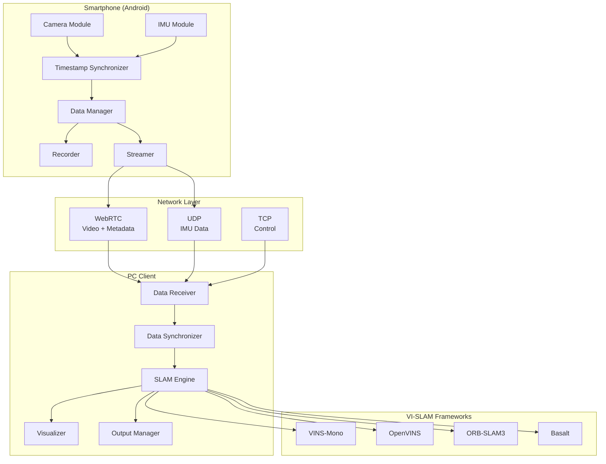

### 2.2 Architecture Patterns

| Pattern | Application | Rationale |
|---------|-------------|-----------|
| **Client-Server** | Smartphone to PC communication | Offload compute-intensive SLAM to PC |
| **Adapter** | VI-SLAM framework integration | Uniform interface for multiple frameworks |
| **Observer** | Pose/status updates | Decouple SLAM engine from consumers |
| **Producer-Consumer** | Data streaming pipeline | Handle rate differences between sensors |
| **Strategy** | Output format selection | Support multiple export formats |
| **Facade** | Calibration module | Simplify complex calibration procedures |

### 2.3 Technology Stack

| Layer | Technology | Version | Rationale |
|-------|------------|---------|-----------|
| **Android App** | Kotlin | 1.9+ | Modern Android development, coroutines support |
| **Android SDK** | Camera2 API | API 26+ | Direct sensor access with timestamps |
| **Android Streaming** | Google WebRTC | M100+ | Industry standard real-time communication |
| **PC Client** | Python | 3.8+ | Rapid development, extensive libraries |
| **PC Native** | C++ | C++17 | Performance-critical SLAM processing |
| **Build System** | CMake | 3.16+ | Cross-platform C++ build |
| **Computer Vision** | OpenCV | 4.5+ | Image processing and visualization |
| **Linear Algebra** | Eigen3 | 3.3+ | Efficient matrix operations |
| **Optimization** | Ceres Solver | 2.0+ | Nonlinear least squares optimization |
| **ROS Integration** | ROS Noetic/Humble | - | Robot ecosystem integration |
| **Message Queue** | ZeroMQ | 4.3+ | High-performance messaging |

### 2.4 Layer Architecture

```
+------------------------------------------------------------------+
|                        Presentation Layer                         |
|  +----------------+  +----------------+  +--------------------+   |
|  | Android UI     |  | PC GUI         |  | RViz/Visualization |   |
|  | (Jetpack)      |  | (Qt/PyQt)      |  |                    |   |
|  +----------------+  +----------------+  +--------------------+   |
+------------------------------------------------------------------+
|                        Application Layer                          |
|  +----------------+  +----------------+  +--------------------+   |
|  | Capture        |  | SLAM           |  | Export             |   |
|  | Controller     |  | Controller     |  | Controller         |   |
|  +----------------+  +----------------+  +--------------------+   |
+------------------------------------------------------------------+
|                         Domain Layer                              |
|  +----------------+  +----------------+  +--------------------+   |
|  | Sensor Data    |  | SLAM           |  | Calibration        |   |
|  | Processing     |  | Processing     |  | Processing         |   |
|  +----------------+  +----------------+  +--------------------+   |
+------------------------------------------------------------------+
|                      Infrastructure Layer                         |
|  +----------------+  +----------------+  +--------------------+   |
|  | Camera2/       |  | WebRTC/UDP     |  | File System/       |   |
|  | SensorManager  |  | Network        |  | Storage            |   |
|  +----------------+  +----------------+  +--------------------+   |
+------------------------------------------------------------------+
```

---

## 3. Component Design

### CMP-001: Camera Capture Module

**Source Features**: SF-001
**Responsibility**: Capture frames from smartphone rear camera with accurate timestamps
**Type**: Service

#### 3.1.1 Interface Definition

```kotlin
interface ICameraCapture {
    fun initialize(config: CameraConfig): Result<Unit>
    fun startCapture(): Result<Unit>
    fun stopCapture(): Result<Unit>
    fun release(): Unit

    fun setFrameCallback(callback: (CameraFrame) -> Unit)
    fun getStatus(): CaptureStatus
    fun getSupportedConfigurations(): List<CameraConfig>
}

data class CameraConfig(
    val resolution: Resolution,
    val fps: Int,
    val format: ImageFormat,
    val exposureMode: ExposureMode
)

data class CameraFrame(
    val timestampNs: Long,
    val image: ByteArray,
    val width: Int,
    val height: Int,
    val format: ImageFormat,
    val metadata: FrameMetadata
)

data class FrameMetadata(
    val exposureTimeNs: Long,
    val iso: Int,
    val focalLengthMm: Float,
    val sequenceNumber: Long
)

enum class CaptureStatus {
    UNINITIALIZED, READY, CAPTURING, ERROR
}
```

#### 3.1.2 Class Diagram

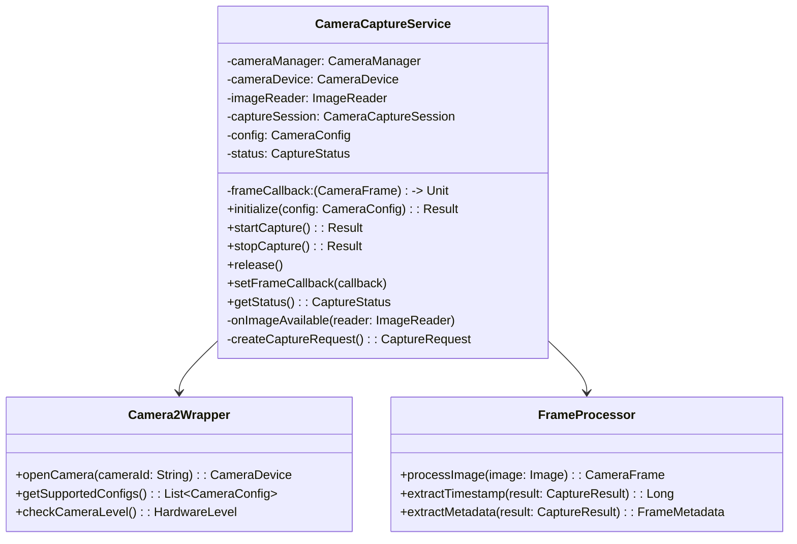

#### 3.1.3 Dependencies

- **Internal**: Timestamp Synchronizer (CMP-003)
- **External**: Android Camera2 API, Kotlin Coroutines

#### 3.1.4 Error Handling

| Error Code | Condition | Handling |
|------------|-----------|----------|
| CAM_E001 | Camera device unavailable | Retry 3 times with 1s delay, then notify user |
| CAM_E002 | Insufficient permissions | Prompt user for permission |
| CAM_E003 | Camera disconnected | Release resources, offer reconnection |
| CAM_E004 | Memory pressure | Reduce buffer size, log warning |
| CAM_E005 | Frame drop detected | Log event, continue capture |

#### 3.1.5 Implementation Notes

- Use `SENSOR_TIMESTAMP` for accurate frame timing
- Implement double-buffering to prevent frame drops
- Support both YUV_420_888 and JPEG formats
- Handle camera interrupts (phone calls) gracefully

---

### CMP-002: IMU Capture Module

**Source Features**: SF-002
**Responsibility**: Capture accelerometer and gyroscope data at high frequency
**Type**: Service

#### 3.2.1 Interface Definition

```kotlin
interface IIMUCapture {
    fun initialize(config: IMUConfig): Result<Unit>
    fun startCapture(): Result<Unit>
    fun stopCapture(): Result<Unit>
    fun release(): Unit

    fun setIMUCallback(callback: (IMUSample) -> Unit)
    fun getLatestSamples(count: Int): List<IMUSample>
    fun getStatus(): CaptureStatus
    fun getActualSamplingRate(): Float
}

data class IMUConfig(
    val targetRateHz: Int,
    val sensorType: IMUSensorType,
    val bufferSize: Int
)

data class IMUSample(
    val timestampNs: Long,
    val accX: Double,  // m/s^2
    val accY: Double,
    val accZ: Double,
    val gyroX: Double, // rad/s
    val gyroY: Double,
    val gyroZ: Double
)

enum class IMUSensorType {
    CALIBRATED,
    UNCALIBRATED
}
```

#### 3.2.2 Class Diagram

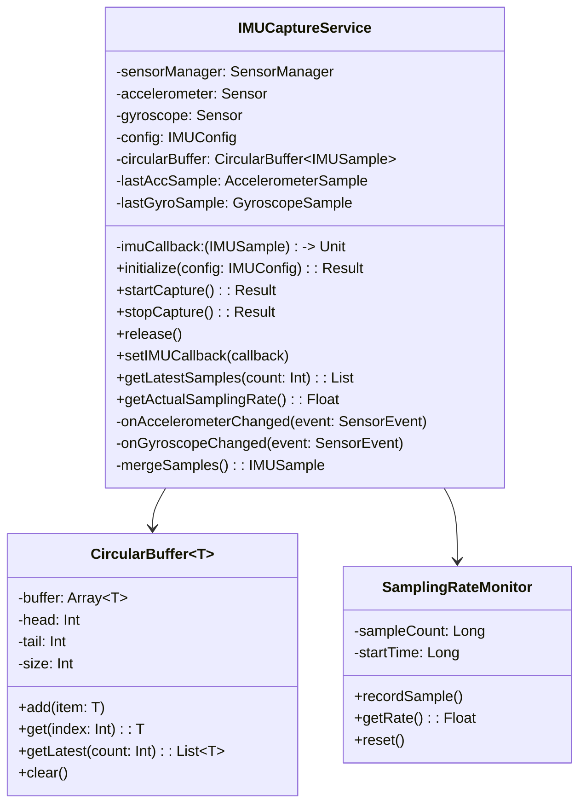

#### 3.2.3 Dependencies

- **Internal**: Timestamp Synchronizer (CMP-003)
- **External**: Android SensorManager API

#### 3.2.4 Error Handling

| Error Code | Condition | Handling |
|------------|-----------|----------|
| IMU_E001 | Sensor not available | Notify user, disable feature |
| IMU_E002 | Sampling rate below minimum | Warn user, use interpolation |
| IMU_E003 | Buffer overflow | Drop oldest samples, log warning |
| IMU_E004 | Invalid sensor data | Discard sample, log anomaly |
| IMU_E005 | Timestamp discontinuity | Recalibrate time reference |

#### 3.2.5 Implementation Notes

- Use `SENSOR_DELAY_FASTEST` for maximum sampling rate
- Implement sensor fusion to combine accelerometer and gyroscope
- Maintain circular buffer with 5 seconds of data at 500Hz
- Monitor actual vs. target sampling rate

---

### CMP-003: Timestamp Synchronizer

**Source Features**: SF-003
**Responsibility**: Align camera and IMU timestamps into unified timeline
**Type**: Service

#### 3.3.1 Interface Definition

```kotlin
interface ITimestampSynchronizer {
    fun initialize(): Result<Unit>
    fun synchronize(frame: CameraFrame, imuBuffer: List<IMUSample>): SynchronizedData
    fun getInterpolatedIMU(timestampNs: Long): IMUSample?
    fun getIMUSamplesBetween(startNs: Long, endNs: Long): List<IMUSample>
    fun getTimeOffset(): Long
    fun getSyncStatus(): SyncStatus
}

data class SynchronizedData(
    val frame: CameraFrame,
    val interpolatedIMU: IMUSample,
    val imuSamplesBetweenFrames: List<IMUSample>,
    val syncQuality: SyncQuality
)

enum class SyncQuality {
    EXCELLENT,  // < 1ms gap
    GOOD,       // 1-5ms gap
    FAIR,       // 5-20ms gap
    POOR        // > 20ms gap
}

enum class SyncStatus {
    SYNCED, DRIFT_DETECTED, LOST
}
```

#### 3.3.2 Synchronization Algorithm

```
Algorithm: Camera-IMU Timestamp Alignment

Input: CameraFrame with timestamp T_cam, IMU circular buffer
Output: SynchronizedData

1. Find IMU samples bracketing T_cam:
   - T_imu_before = max(T_imu | T_imu <= T_cam)
   - T_imu_after = min(T_imu | T_imu > T_cam)

2. If gap (T_imu_after - T_imu_before) > 50ms:
   - Flag as POOR quality
   - Use nearest-neighbor instead of interpolation

3. Calculate interpolation ratio:
   - ratio = (T_cam - T_imu_before) / (T_imu_after - T_imu_before)

4. Linear interpolation for IMU at T_cam:
   - acc_interp = acc_before + ratio * (acc_after - acc_before)
   - gyro_interp = gyro_before + ratio * (gyro_after - gyro_before)

5. Collect all IMU samples since previous frame

6. Return SynchronizedData
```

#### 3.3.3 Dependencies

- **Internal**: Camera Capture (CMP-001), IMU Capture (CMP-002)
- **External**: None

#### 3.3.4 Error Handling

| Error Code | Condition | Handling |
|------------|-----------|----------|
| SYNC_E001 | No IMU data for timestamp | Mark frame as IMU-unavailable |
| SYNC_E002 | Large time gap (> 50ms) | Use nearest-neighbor, log warning |
| SYNC_E003 | Clock discontinuity | Recalibrate time reference |
| SYNC_E004 | Drift detected | Apply correction factor |

---

### CMP-004: Data Manager

**Source Features**: SF-004, SF-005
**Responsibility**: Coordinate data flow between capture, storage, and streaming
**Type**: Controller

#### 3.4.1 Interface Definition

```kotlin
interface IDataManager {
    fun initialize(): Result<Unit>
    fun startSession(mode: SessionMode): Result<SessionInfo>
    fun stopSession(): Result<SessionSummary>

    fun getSessionStatus(): SessionStatus
    fun getStatistics(): SessionStatistics

    fun setRecorderEnabled(enabled: Boolean)
    fun setStreamerEnabled(enabled: Boolean)
}

enum class SessionMode {
    RECORD_ONLY,
    STREAM_ONLY,
    RECORD_AND_STREAM
}

data class SessionInfo(
    val sessionId: String,
    val startTime: Long,
    val mode: SessionMode,
    val outputDirectory: String?
)

data class SessionStatistics(
    val frameCount: Long,
    val imuSampleCount: Long,
    val durationMs: Long,
    val frameDropCount: Long,
    val averageFps: Float,
    val averageImuRate: Float
)
```

#### 3.4.2 Class Diagram

```mermaid
classDiagram
    class DataManager {
        -cameraCapture: ICameraCapture
        -imuCapture: IIMUCapture
        -timestampSync: ITimestampSynchronizer
        -recorder: IRecorder
        -streamer: IStreamer
        -sessionInfo: SessionInfo
        -statistics: SessionStatistics
        +initialize(): Result
        +startSession(mode: SessionMode): Result
        +stopSession(): Result
        +getSessionStatus(): SessionStatus
        +getStatistics(): SessionStatistics
        -onSynchronizedData(data: SynchronizedData)
    }

    class DataRouter {
        -destinations: List~IDataDestination~
        +route(data: SynchronizedData)
        +addDestination(dest: IDataDestination)
        +removeDestination(dest: IDataDestination)
    }

    interface IDataDestination {
        +onData(data: SynchronizedData)
        +isEnabled(): Boolean
    }

    DataManager --> DataRouter
    DataRouter --> IDataDestination
```

#### 3.4.3 Dependencies

- **Internal**: Camera (CMP-001), IMU (CMP-002), Sync (CMP-003), Recorder (CMP-005), Streamer (CMP-006)
- **External**: None

---

### CMP-005: Recorder Module

**Source Features**: SF-004
**Responsibility**: Store video and IMU data locally with proper format
**Type**: Service

#### 3.5.1 Interface Definition

```kotlin
interface IRecorder {
    fun initialize(config: RecorderConfig): Result<Unit>
    fun startRecording(outputDir: String): Result<Unit>
    fun stopRecording(): Result<RecordingSummary>

    fun onData(data: SynchronizedData)
    fun getStatus(): RecordingStatus
    fun getStorageInfo(): StorageInfo
}

data class RecorderConfig(
    val videoCodec: VideoCodec,
    val videoQuality: VideoQuality,
    val imuFormat: IMUFormat,
    val generateMetadata: Boolean
)

data class RecordingSummary(
    val videoFile: String,
    val imuFile: String,
    val metadataFile: String,
    val frameCount: Long,
    val imuSampleCount: Long,
    val durationMs: Long,
    val fileSizeBytes: Long,
    val checksumValid: Boolean
)

enum class VideoCodec { H264, H265 }
enum class IMUFormat { CSV, BINARY }
```

#### 3.5.2 Output File Structure

```
session_20260124_100000/
├── video.mp4           # H.264 encoded video
├── imu.csv             # IMU data with timestamps
├── metadata.json       # Session metadata
├── frames/             # (Optional) Individual frames
│   ├── frame_000001.jpg
│   └── ...
└── checksums.sha256    # Data integrity verification
```

#### 3.5.3 Dependencies

- **Internal**: Data Manager (CMP-004)
- **External**: Android MediaCodec, File System

---

### CMP-006: Streamer Module

**Source Features**: SF-005
**Responsibility**: Stream camera and IMU data to PC in real-time
**Type**: Service

#### 3.6.1 Interface Definition

```kotlin
interface IStreamer {
    fun initialize(config: StreamerConfig): Result<Unit>
    fun connect(serverAddress: String): Result<Unit>
    fun disconnect(): Result<Unit>

    fun startStreaming(): Result<Unit>
    fun stopStreaming(): Result<Unit>

    fun onData(data: SynchronizedData)
    fun getConnectionStatus(): ConnectionStatus
    fun getStreamingStatistics(): StreamingStatistics
}

data class StreamerConfig(
    val webrtcPort: Int,
    val udpPort: Int,
    val videoBitrate: Int,
    val adaptiveBitrate: Boolean
)

data class StreamingStatistics(
    val bytesSent: Long,
    val framesSent: Long,
    val imuPacketsSent: Long,
    val packetLossRate: Float,
    val averageLatencyMs: Float,
    val currentBitrate: Int
)

enum class ConnectionStatus {
    DISCONNECTED, CONNECTING, CONNECTED, RECONNECTING, ERROR
}
```

#### 3.6.2 Streaming Architecture

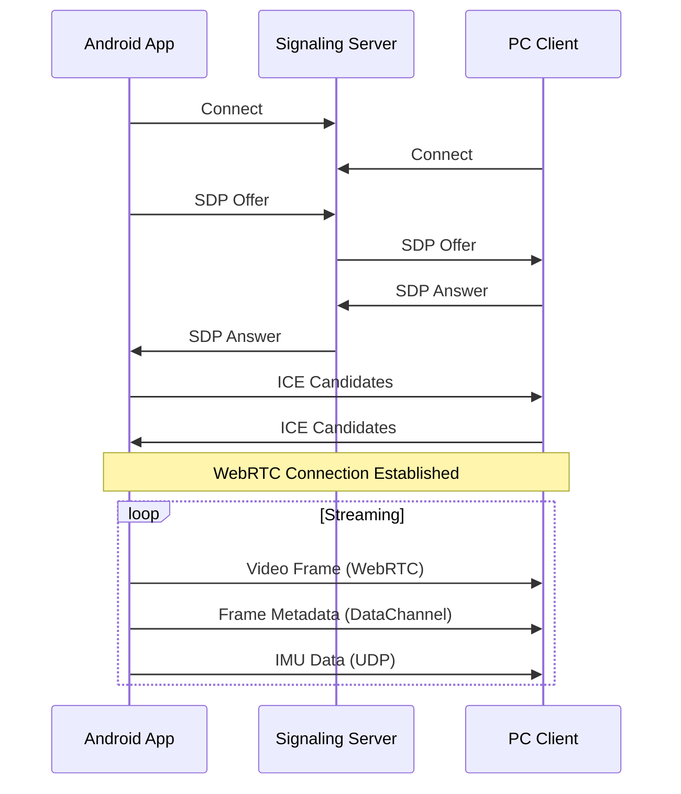

#### 3.6.3 Dependencies

- **Internal**: Data Manager (CMP-004)
- **External**: Google WebRTC, UDP Sockets

#### 3.6.4 Protocol Details

**WebRTC Data Channel Message Format:**

```json
{
    "type": "frame_metadata",
    "timestamp_ns": 1234567890123456789,
    "sequence": 12345,
    "exposure_ns": 8333333,
    "iso": 100,
    "sync_quality": "EXCELLENT"
}
```

**UDP IMU Packet Format (56 bytes):**

| Offset | Size | Type | Field |
|--------|------|------|-------|
| 0 | 8 | int64 | timestamp_ns |
| 8 | 8 | double | acc_x (m/s^2) |
| 16 | 8 | double | acc_y |
| 24 | 8 | double | acc_z |
| 32 | 8 | double | gyro_x (rad/s) |
| 40 | 8 | double | gyro_y |
| 48 | 8 | double | gyro_z |

---

### CMP-007: PC Data Receiver

**Source Features**: SF-006
**Responsibility**: Receive and decode video/IMU data from smartphone
**Type**: Service

#### 3.7.1 Interface Definition

```cpp
class IDataReceiver {
public:
    virtual ~IDataReceiver() = default;

    virtual bool initialize(const ReceiverConfig& config) = 0;
    virtual bool startListening() = 0;
    virtual bool stopListening() = 0;

    virtual void setFrameCallback(std::function<void(const DecodedFrame&)> callback) = 0;
    virtual void setIMUCallback(std::function<void(const IMUSample&)> callback) = 0;

    virtual ConnectionStatus getStatus() const = 0;
    virtual ReceiverStatistics getStatistics() const = 0;
};

struct ReceiverConfig {
    int webrtcPort;
    int udpPort;
    int tcpControlPort;
    int bufferSizeMs;
};

struct DecodedFrame {
    int64_t timestampNs;
    cv::Mat image;
    FrameMetadata metadata;
};

struct ReceiverStatistics {
    int64_t bytesReceived;
    int64_t framesReceived;
    int64_t imuPacketsReceived;
    float packetLossRate;
    float averageLatencyMs;
    int bufferUtilization;
};
```

#### 3.7.2 Class Diagram

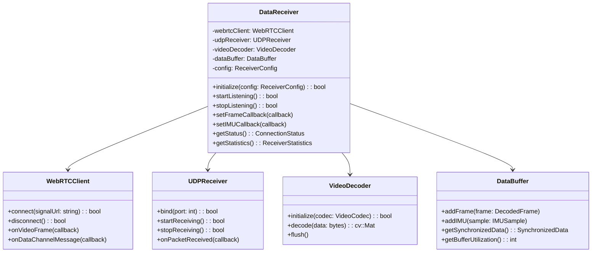

#### 3.7.3 Dependencies

- **Internal**: Data Synchronizer (CMP-008)
- **External**: aiortc (Python WebRTC), FFmpeg, OpenCV

---

### CMP-008: PC Data Synchronizer

**Source Features**: SF-003, SF-006
**Responsibility**: Synchronize received video and IMU data on PC side
**Type**: Service

#### 3.8.1 Interface Definition

```cpp
class IDataSynchronizer {
public:
    virtual ~IDataSynchronizer() = default;

    virtual bool initialize(const SyncConfig& config) = 0;
    virtual void addFrame(const DecodedFrame& frame) = 0;
    virtual void addIMU(const IMUSample& sample) = 0;

    virtual void setSynchronizedDataCallback(
        std::function<void(const SynchronizedData&)> callback) = 0;

    virtual SyncStatus getStatus() const = 0;
    virtual int64_t getEstimatedOffset() const = 0;
};

struct SyncConfig {
    int64_t maxTimeDifferenceNs;
    int imuBufferSize;
    bool enableOffsetEstimation;
};

struct SynchronizedData {
    DecodedFrame frame;
    IMUSample interpolatedIMU;
    std::vector<IMUSample> imuBetweenFrames;
    SyncQuality quality;
};
```

#### 3.8.2 Dependencies

- **Internal**: Data Receiver (CMP-007), SLAM Engine (CMP-009)
- **External**: None

---

### CMP-009: SLAM Engine

**Source Features**: SF-007, SF-009, SF-010
**Responsibility**: Coordinate VI-SLAM processing with multiple framework support
**Type**: Controller

#### 3.9.1 Interface Definition

```cpp
class ISLAMEngine {
public:
    virtual ~ISLAMEngine() = default;

    virtual bool initialize(const SLAMConfig& config) = 0;
    virtual bool loadCalibration(const std::string& calibPath) = 0;
    virtual bool selectFramework(FrameworkType type) = 0;

    virtual void processData(const SynchronizedData& data) = 0;

    virtual bool getPose(Pose6DoF& pose) const = 0;
    virtual TrackingStatus getStatus() const = 0;
    virtual std::vector<MapPoint> getMapPoints() const = 0;

    virtual void reset() = 0;
    virtual void shutdown() = 0;

    virtual void setPoseCallback(std::function<void(const Pose6DoF&)> callback) = 0;
    virtual void setStatusCallback(std::function<void(TrackingStatus)> callback) = 0;
};

struct SLAMConfig {
    FrameworkType defaultFramework;
    std::string configDirectory;
    bool enableVisualization;
    bool enableMapSaving;
};

enum class FrameworkType {
    VINS_MONO,
    OPENVINS,
    ORB_SLAM3,
    BASALT
};

struct Pose6DoF {
    int64_t timestampNs;
    double position[3];      // x, y, z in meters
    double orientation[4];   // qw, qx, qy, qz (quaternion)
    double covariance[36];   // 6x6 covariance matrix (optional)
    bool valid;
};

enum class TrackingStatus {
    UNINITIALIZED,
    INITIALIZING,
    TRACKING,
    LOST,
    RELOCALIZATION
};

struct MapPoint {
    int64_t id;
    double position[3];
    uint8_t color[3];
    int observations;
};
```

#### 3.9.2 Class Diagram

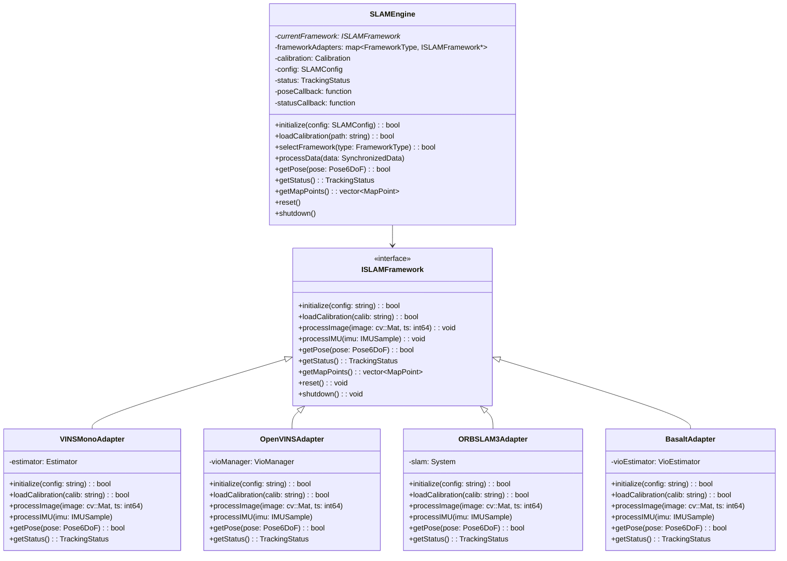

#### 3.9.3 State Machine

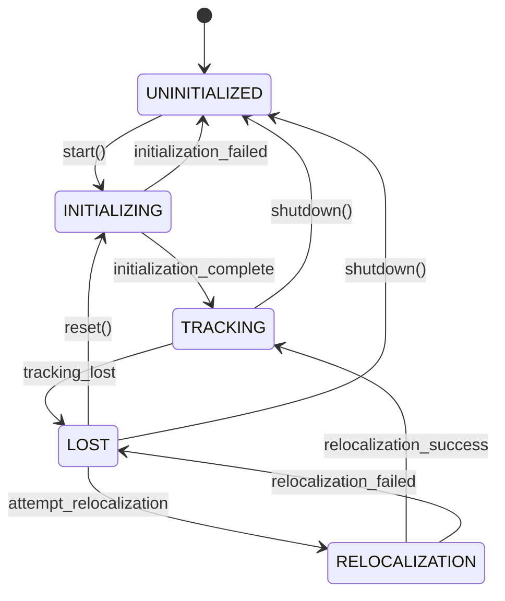

#### 3.9.4 Dependencies

- **Internal**: Data Synchronizer (CMP-008), Output Manager (CMP-010)
- **External**: VINS-Mono, OpenVINS, ORB-SLAM3, Basalt libraries

#### 3.9.5 Error Handling

| Error Code | Condition | Handling |
|------------|-----------|----------|
| SLAM_E001 | Framework initialization failed | Log error, try alternative framework |
| SLAM_E002 | Calibration loading failed | Notify user, require valid calibration |
| SLAM_E003 | Tracking lost | Attempt relocalization, reset if failed |
| SLAM_E004 | Framework crash | Capture state, offer restart |
| SLAM_E005 | Memory exhaustion | Clear old map points, warn user |

---

### CMP-010: Output Manager

**Source Features**: SF-011, SF-012, SF-013
**Responsibility**: Export SLAM results and provide real-time pose API
**Type**: Controller

#### 3.10.1 Interface Definition

```cpp
class IOutputManager {
public:
    virtual ~IOutputManager() = default;

    virtual bool initialize(const OutputConfig& config) = 0;

    // Trajectory Export
    virtual bool exportTrajectory(const std::string& path, TrajectoryFormat format) = 0;

    // Point Cloud Export
    virtual bool exportPointCloud(const std::string& path, PointCloudFormat format) = 0;

    // Real-time API
    virtual bool startROSPublishing() = 0;
    virtual bool stopROSPublishing() = 0;
    virtual bool startZMQPublishing(int port) = 0;
    virtual bool stopZMQPublishing() = 0;

    // Pose input from SLAM
    virtual void onPose(const Pose6DoF& pose) = 0;
    virtual void onMapPoints(const std::vector<MapPoint>& points) = 0;
};

struct OutputConfig {
    bool enableROS;
    bool enableZMQ;
    int zmqPort;
    std::string rosNodeName;
};

enum class TrajectoryFormat {
    TUM,
    KITTI,
    EUROC
};

enum class PointCloudFormat {
    PLY_ASCII,
    PLY_BINARY,
    PCD
};
```

#### 3.10.2 ROS Topics

| Topic | Message Type | Rate | Description |
|-------|--------------|------|-------------|
| /vi_slam/pose | geometry_msgs/PoseStamped | 30 Hz | Current pose |
| /vi_slam/odometry | nav_msgs/Odometry | 30 Hz | Pose with velocity |
| /vi_slam/path | nav_msgs/Path | 1 Hz | Full trajectory |
| /vi_slam/pointcloud | sensor_msgs/PointCloud2 | 1 Hz | Map points |
| /vi_slam/image | sensor_msgs/Image | 30 Hz | Camera feed |
| /vi_slam/status | std_msgs/String | 1 Hz | Tracking status |

#### 3.10.3 TF Tree

```
map
 └── odom
      └── base_link
           ├── camera_link
           └── imu_link
```

#### 3.10.4 ZMQ API

**Socket Configuration:**
- Type: PUB/SUB
- Port: 5555 (configurable)
- Protocol: TCP

**Message Format (JSON):**

```json
{
    "timestamp_ns": 1234567890123456789,
    "position": {
        "x": 1.234,
        "y": 2.345,
        "z": 0.567
    },
    "orientation": {
        "w": 0.707,
        "x": 0.0,
        "y": 0.707,
        "z": 0.0
    },
    "status": "TRACKING",
    "velocity": {
        "linear": [0.1, 0.0, 0.0],
        "angular": [0.0, 0.0, 0.01]
    }
}
```

#### 3.10.5 Dependencies

- **Internal**: SLAM Engine (CMP-009)
- **External**: ROS (Noetic/Humble), ZeroMQ, PCL

---

### CMP-011: Calibration Module

**Source Features**: SF-008
**Responsibility**: Camera intrinsic and camera-IMU extrinsic calibration
**Type**: Service

#### 3.11.1 Interface Definition

```kotlin
// Android Side
interface ICalibrationCapture {
    fun startIntrinsicCalibration(config: IntrinsicCalibConfig): Result<Unit>
    fun captureCalibrationImage(): Result<CalibrationCapture>
    fun finishIntrinsicCalibration(): Result<IntrinsicCalibResult>

    fun startExtrinsicCalibration(config: ExtrinsicCalibConfig): Result<Unit>
    fun recordExtrinsicSequence(): Result<ExtrinsicCalibData>

    fun getCalibrationStatus(): CalibrationStatus
    fun getCoverageMap(): CoverageMap
}

data class IntrinsicCalibConfig(
    val targetType: CalibrationTargetType,
    val targetSize: TargetSize,
    val minCaptures: Int,
    val coverageRegions: Int
)

data class IntrinsicCalibResult(
    val fx: Double,
    val fy: Double,
    val cx: Double,
    val cy: Double,
    val distortionCoeffs: DoubleArray,
    val reprojectionError: Double,
    val captureCount: Int
)

enum class CalibrationTargetType {
    CHECKERBOARD,
    APRILGRID,
    CIRCLES_GRID
}
```

```cpp
// PC Side - Kalibr Integration
class ICalibrationProcessor {
public:
    virtual ~ICalibrationProcessor() = default;

    virtual bool processIntrinsicData(const std::string& dataPath,
                                       IntrinsicCalibResult& result) = 0;
    virtual bool processExtrinsicData(const std::string& dataPath,
                                       ExtrinsicCalibResult& result) = 0;

    virtual bool exportCalibration(const std::string& outputPath,
                                    CalibrationFormat format) = 0;
};

struct ExtrinsicCalibResult {
    double T_cam_imu[4][4];  // 4x4 transformation matrix
    double timeOffsetS;       // Camera-IMU time offset
    double reprojectionError;
    double gyroNoise;
    double accelNoise;
    double gyroBias;
    double accelBias;
};

enum class CalibrationFormat {
    VINS_MONO,
    OPENVINS,
    ORB_SLAM3,
    KALIBR
};
```

#### 3.11.2 Calibration Workflow

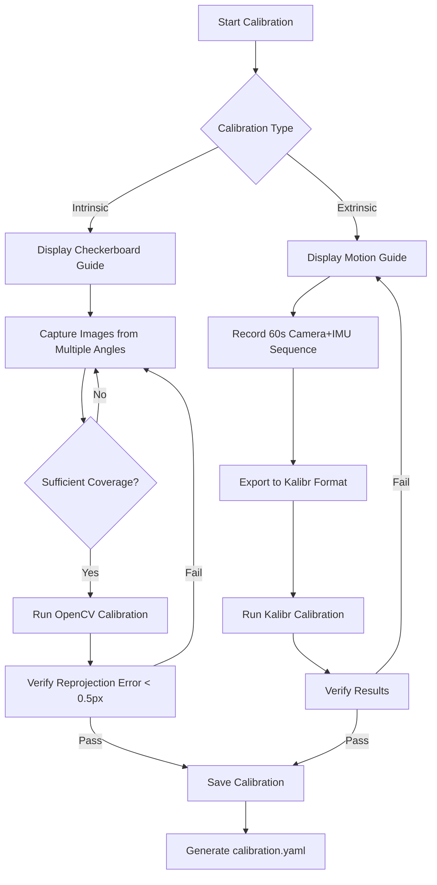

#### 3.11.3 Dependencies

- **Internal**: Camera (CMP-001), IMU (CMP-002), Recorder (CMP-005)
- **External**: OpenCV (intrinsic), Kalibr (extrinsic)

---

### CMP-012: Visualizer Module

**Source Features**: SF-012
**Responsibility**: Real-time visualization of trajectory, point cloud, and camera feed
**Type**: Service

#### 3.12.1 Interface Definition

```cpp
class IVisualizer {
public:
    virtual ~IVisualizer() = default;

    virtual bool initialize(const VisualizerConfig& config) = 0;
    virtual void show() = 0;
    virtual void hide() = 0;
    virtual void close() = 0;

    virtual void updatePose(const Pose6DoF& pose) = 0;
    virtual void updatePointCloud(const std::vector<MapPoint>& points) = 0;
    virtual void updateImage(const cv::Mat& image,
                             const std::vector<Feature>& features) = 0;
    virtual void updateStatus(TrackingStatus status,
                              const std::string& message) = 0;

    virtual void setViewMode(ViewMode mode) = 0;
    virtual bool isRunning() const = 0;
};

struct VisualizerConfig {
    int windowWidth;
    int windowHeight;
    bool showTrajectory;
    bool showPointCloud;
    bool showImage;
    bool showStatus;
    float pointSize;
    float trajectoryLineWidth;
};

enum class ViewMode {
    FOLLOW_CAMERA,
    FREE_VIEW,
    TOP_DOWN,
    SIDE_VIEW
};

struct Feature {
    cv::Point2f position;
    FeatureStatus status;
};

enum class FeatureStatus {
    TRACKED,
    NEW,
    LOST
};
```

#### 3.12.2 Dependencies

- **Internal**: SLAM Engine (CMP-009)
- **External**: OpenGL, Pangolin or Dear ImGui

---

## 4. Data Design

### 4.1 Entity-Relationship Diagram

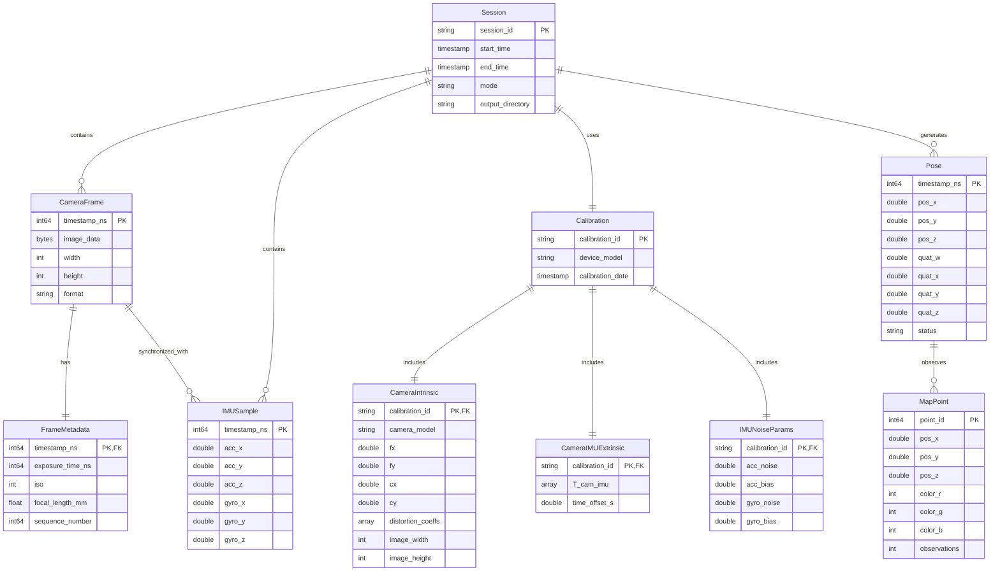

### 4.2 Data Models

#### 4.2.1 IMU Sample

```yaml
entity: IMUSample
table: imu_samples
fields:
  - name: timestamp_ns
    type: int64
    primary_key: true
    description: Sensor timestamp in nanoseconds
  - name: acc_x
    type: float64
    unit: m/s^2
    constraints:
      - not_null
  - name: acc_y
    type: float64
    unit: m/s^2
    constraints:
      - not_null
  - name: acc_z
    type: float64
    unit: m/s^2
    constraints:
      - not_null
  - name: gyro_x
    type: float64
    unit: rad/s
    constraints:
      - not_null
  - name: gyro_y
    type: float64
    unit: rad/s
    constraints:
      - not_null
  - name: gyro_z
    type: float64
    unit: rad/s
    constraints:
      - not_null
```

#### 4.2.2 Camera Frame

```yaml
entity: CameraFrame
table: camera_frames
fields:
  - name: timestamp_ns
    type: int64
    primary_key: true
    description: Sensor timestamp in nanoseconds
  - name: image_data
    type: blob
    description: Raw or encoded image data
  - name: width
    type: int32
    constraints:
      - not_null
      - min: 320
      - max: 4096
  - name: height
    type: int32
    constraints:
      - not_null
      - min: 240
      - max: 2160
  - name: format
    type: string
    constraints:
      - enum: [YUV_420_888, JPEG, RGB]
```

#### 4.2.3 Pose (6DoF)

```yaml
entity: Pose6DoF
table: poses
fields:
  - name: timestamp_ns
    type: int64
    primary_key: true
  - name: position_x
    type: float64
    unit: meters
  - name: position_y
    type: float64
    unit: meters
  - name: position_z
    type: float64
    unit: meters
  - name: orientation_w
    type: float64
    description: Quaternion W component
    constraints:
      - min: -1.0
      - max: 1.0
  - name: orientation_x
    type: float64
    description: Quaternion X component
  - name: orientation_y
    type: float64
    description: Quaternion Y component
  - name: orientation_z
    type: float64
    description: Quaternion Z component
  - name: status
    type: string
    constraints:
      - enum: [TRACKING, LOST, INITIALIZING]
```

#### 4.2.4 Calibration Parameters

```yaml
entity: Calibration
fields:
  - name: camera_model
    type: string
    constraints:
      - enum: [pinhole, fisheye, equidistant]
  - name: fx
    type: float64
    unit: pixels
    description: Focal length X
  - name: fy
    type: float64
    unit: pixels
    description: Focal length Y
  - name: cx
    type: float64
    unit: pixels
    description: Principal point X
  - name: cy
    type: float64
    unit: pixels
    description: Principal point Y
  - name: distortion_coeffs
    type: array[float64]
    length: 4-8
    description: Radial-tangential distortion coefficients
  - name: T_cam_imu
    type: matrix[4][4]
    description: Camera-IMU transformation matrix
  - name: time_offset_s
    type: float64
    unit: seconds
    description: Camera-IMU time offset
  - name: imu_noise
    type: object
    fields:
      - acc_n: float64  # Accelerometer noise density
      - acc_w: float64  # Accelerometer random walk
      - gyr_n: float64  # Gyroscope noise density
      - gyr_w: float64  # Gyroscope random walk
```

### 4.3 Data Access Patterns

| Operation | Frequency | Indexes Required | Notes |
|-----------|-----------|------------------|-------|
| Insert IMU sample | 200-500 Hz | timestamp_ns (PK) | High-frequency writes |
| Insert Camera frame | 30-60 Hz | timestamp_ns (PK) | Large blob data |
| Query IMU range | 30 Hz | timestamp_ns range | For synchronization |
| Query latest pose | 30 Hz | timestamp_ns DESC | Real-time output |
| Export trajectory | On-demand | timestamp_ns ASC | Sequential read |
| Export point cloud | On-demand | None | Full scan |

### 4.4 File Formats

#### 4.4.1 IMU CSV Format

```csv
#timestamp[ns],ax[m/s^2],ay[m/s^2],az[m/s^2],gx[rad/s],gy[rad/s],gz[rad/s]
1000000000,0.1,-0.2,9.8,0.001,-0.002,0.001
1005000000,0.11,-0.19,9.81,0.0011,-0.0019,0.001
```

#### 4.4.2 Trajectory TUM Format

```
# timestamp tx ty tz qx qy qz qw
1403636579.763555992 4.688319 -1.786938 0.783338 0.531152 -0.083869 -0.018332 0.843092
1403636579.863555992 4.688123 -1.786742 0.783421 0.531248 -0.083712 -0.018421 0.843012
```

#### 4.4.3 Metadata JSON Format

```json
{
    "format_version": "1.0",
    "device": {
        "model": "Pixel 6",
        "manufacturer": "Google",
        "android_version": "12",
        "api_level": 31
    },
    "camera": {
        "resolution": [1920, 1080],
        "fps": 30,
        "codec": "H.264",
        "timestamp_source": "SENSOR_TIMESTAMP",
        "camera2_level": "FULL"
    },
    "imu": {
        "accelerometer_type": "TYPE_ACCELEROMETER",
        "gyroscope_type": "TYPE_GYROSCOPE",
        "sampling_rate_hz": 200
    },
    "calibration": {
        "camera_model": "pinhole",
        "fx": 1500.0,
        "fy": 1500.0,
        "cx": 960.0,
        "cy": 540.0,
        "distortion_model": "radtan",
        "distortion_coeffs": [-0.28, 0.07, 0.0, 0.0],
        "T_cam_imu": [
            [1, 0, 0, 0],
            [0, 1, 0, 0],
            [0, 0, 1, 0],
            [0, 0, 0, 1]
        ],
        "time_offset_s": 0.0
    },
    "recording": {
        "start_time_utc": "2026-01-24T10:00:00.000Z",
        "duration_ms": 60000,
        "frame_count": 1800,
        "imu_sample_count": 12000,
        "file_size_bytes": 125000000
    }
}
```

#### 4.4.4 Calibration YAML Format (VINS-Mono Compatible)

```yaml
%YAML:1.0

model_type: PINHOLE
camera_name: smartphone_cam
image_width: 1920
image_height: 1080

distortion_parameters:
    k1: -0.28
    k2: 0.07
    p1: 0.0
    p2: 0.0

projection_parameters:
    fx: 1500.0
    fy: 1500.0
    cx: 960.0
    cy: 540.0

body_T_cam0:
    - [1.0, 0.0, 0.0, 0.0]
    - [0.0, 1.0, 0.0, 0.0]
    - [0.0, 0.0, 1.0, 0.0]
    - [0.0, 0.0, 0.0, 1.0]

td: 0.0

imu_params:
    acc_n: 0.08
    acc_w: 0.00004
    gyr_n: 0.004
    gyr_w: 2.0e-6
```

---

## 5. Interface Design

### 5.1 API Endpoints

#### 5.1.1 WebRTC Signaling API

**Base URL**: `ws://{server_ip}:{port}/signaling`

##### Connect

**WebSocket Message**:
```json
{
    "type": "connect",
    "client_id": "smartphone_001",
    "client_type": "sensor"
}
```

**Response**:
```json
{
    "type": "connected",
    "session_id": "sess_abc123",
    "server_time_ns": 1234567890123456789
}
```

##### SDP Offer

**WebSocket Message**:
```json
{
    "type": "offer",
    "sdp": "v=0\r\no=- 4611731400430051336 2 IN IP4 127.0.0.1\r\n..."
}
```

##### SDP Answer

**WebSocket Message**:
```json
{
    "type": "answer",
    "sdp": "v=0\r\no=- 4611731400430051336 2 IN IP4 127.0.0.1\r\n..."
}
```

##### ICE Candidate

**WebSocket Message**:
```json
{
    "type": "candidate",
    "candidate": "candidate:842163049 1 udp 1677729535 192.168.1.100 51234 typ srflx..."
}
```

#### 5.1.2 Control API (TCP)

**Port**: 9001 (configurable)

##### Start Streaming

**Request**:
```json
{
    "command": "start_streaming",
    "config": {
        "video_resolution": "1080p",
        "video_fps": 30,
        "imu_rate_hz": 200
    }
}
```

**Response**:
```json
{
    "status": "ok",
    "session_id": "stream_001",
    "start_time_ns": 1234567890123456789
}
```

##### Stop Streaming

**Request**:
```json
{
    "command": "stop_streaming"
}
```

**Response**:
```json
{
    "status": "ok",
    "statistics": {
        "frames_sent": 1800,
        "imu_packets_sent": 12000,
        "duration_ms": 60000
    }
}
```

##### Get Status

**Request**:
```json
{
    "command": "get_status"
}
```

**Response**:
```json
{
    "status": "ok",
    "connection_status": "connected",
    "streaming_status": "active",
    "statistics": {
        "current_fps": 29.8,
        "current_imu_rate": 198.5,
        "latency_ms": 45,
        "packet_loss_rate": 0.001
    }
}
```

#### 5.1.3 ZMQ Pose API

**Socket Type**: PUB
**Port**: 5555 (configurable)
**Topic**: "pose"

**Message Format (JSON)**:
```json
{
    "timestamp_ns": 1234567890123456789,
    "position": {
        "x": 1.234,
        "y": 2.345,
        "z": 0.567
    },
    "orientation": {
        "w": 0.707,
        "x": 0.0,
        "y": 0.707,
        "z": 0.0
    },
    "status": "TRACKING",
    "velocity": {
        "linear": [0.1, 0.0, 0.0],
        "angular": [0.0, 0.0, 0.01]
    },
    "covariance": [
        [0.001, 0, 0, 0, 0, 0],
        [0, 0.001, 0, 0, 0, 0],
        [0, 0, 0.001, 0, 0, 0],
        [0, 0, 0, 0.0001, 0, 0],
        [0, 0, 0, 0, 0.0001, 0],
        [0, 0, 0, 0, 0, 0.0001]
    ]
}
```

### 5.2 Event Interfaces

| Event Name | Payload | Publisher | Subscribers |
|------------|---------|-----------|-------------|
| frame_captured | CameraFrame | Camera Module | Data Manager, Streamer |
| imu_sample | IMUSample | IMU Module | Data Manager, Streamer |
| synchronized_data | SynchronizedData | Synchronizer | Recorder, SLAM Engine |
| pose_updated | Pose6DoF | SLAM Engine | Output Manager, Visualizer |
| status_changed | TrackingStatus | SLAM Engine | UI, Output Manager |
| connection_changed | ConnectionStatus | Streamer/Receiver | UI, Data Manager |

### 5.3 External Integrations

| Service | Protocol | Authentication | Notes |
|---------|----------|----------------|-------|
| ROS Master | TCP (XMLRPC) | None (local) | ROS 1 only |
| ROS 2 DDS | UDP Multicast | None (local) | ROS 2 only |
| Kalibr | File-based | N/A | Calibration data exchange |
| VINS-Mono | C++ API | N/A | Direct library integration |
| OpenVINS | C++ API | N/A | Direct library integration |
| ORB-SLAM3 | C++ API | N/A | Direct library integration |
| Basalt | C++ API | N/A | Direct library integration |

### 5.4 User Interface Design

#### 5.4.1 Android App - Main Screen

```
+------------------------------------------+
|  VI-SLAM                    [Settings]   |
+------------------------------------------+
|                                          |
|                                          |
|         +----------------------+         |
|         |                      |         |
|         |   Camera Preview     |         |
|         |                      |         |
|         +----------------------+         |
|                                          |
+------------------------------------------+
| Status Bar                               |
| +--------------------------------------+ |
| | FPS: 30 | IMU: 200Hz | [Connected]   | |
| | Buffer: 85% | Latency: 45ms          | |
| +--------------------------------------+ |
+------------------------------------------+
|                                          |
|  +----------+  +----------+  +--------+  |
|  |  Record  |  |  Stream  |  |  Stop  |  |
|  +----------+  +----------+  +--------+  |
|                                          |
+------------------------------------------+
```

#### 5.4.2 Android App - Settings Screen

```
+------------------------------------------+
|  <- Settings                             |
+------------------------------------------+
| Camera Settings                          |
| +--------------------------------------+ |
| | Resolution      [1080p v]            | |
| | Frame Rate      [30 FPS v]           | |
| | Exposure Mode   [Auto v]             | |
| +--------------------------------------+ |
|                                          |
| IMU Settings                             |
| +--------------------------------------+ |
| | Sampling Rate   [200 Hz v]           | |
| | Sensor Type     [Calibrated v]       | |
| +--------------------------------------+ |
|                                          |
| Streaming Settings                       |
| +--------------------------------------+ |
| | Server IP       [192.168.1.100    ]  | |
| | WebRTC Port     [8080             ]  | |
| | UDP Port        [9000             ]  | |
| +--------------------------------------+ |
|                                          |
| Storage Settings                         |
| +--------------------------------------+ |
| | Output Directory [/sdcard/VI-SLAM/]  | |
| | Video Format     [H.264 v]           | |
| +--------------------------------------+ |
+------------------------------------------+
```

#### 5.4.3 PC Client - Dashboard

```
+------------------------------------------------------------------+
| VI-SLAM PC Client                                    [_][o][X]   |
+------------------------------------------------------------------+
| File  View  Framework  Tools  Help                               |
+------------------------------------------------------------------+
|                                                                   |
| +---------------------------+ +--------------------------------+  |
| | Connection Status         | | SLAM Status                    |  |
| | +---------------------+   | | +----------------------------+ |  |
| | | Smartphone: [*]     |   | | | Framework: VINS-Mono       | |  |
| | | IP: 192.168.1.50    |   | | | Status: TRACKING           | |  |
| | | Latency: 45ms       |   | | | FPS: 30.0                  | |  |
| | | Packet Loss: 0.1%   |   | | | Map Points: 2,345          | |  |
| | +---------------------+   | | +----------------------------+ |  |
| +---------------------------+ +--------------------------------+  |
|                                                                   |
| +---------------------------------------------------------------+ |
| |                                                               | |
| |                     3D Visualization                          | |
| |                                                               | |
| |     [Trajectory Path]  [Point Cloud]  [Camera Frustum]        | |
| |                                                               | |
| |                                                               | |
| +---------------------------------------------------------------+ |
|                                                                   |
| +---------------------------+ +--------------------------------+  |
| | Camera Feed               | | Current Pose                   |  |
| | +---------------------+   | | X: 1.234m  Roll:  0.5 deg     |  |
| | |                     |   | | Y: 2.345m  Pitch: 1.2 deg     |  |
| | |  [Live Image +      |   | | Z: 0.567m  Yaw:   45.3 deg    |  |
| | |   Feature Points]   |   | |                                |  |
| | +---------------------+   | | Velocity: 0.15 m/s             |  |
| +---------------------------+ +--------------------------------+  |
|                                                                   |
| [Start] [Stop] [Reset] [Export Trajectory] [Export Point Cloud]   |
+------------------------------------------------------------------+
| Ready | Session: 00:05:32 | Frames: 10,234 | Memory: 1.2 GB      |
+------------------------------------------------------------------+
```

---

## 6. Security Design

### 6.1 Authentication

| Method | Application | Details |
|--------|-------------|---------|
| Pre-shared Key | Optional network auth | User-configured key for connection |
| None | Default local network | Trust local network environment |

**Pre-shared Key Flow**:
1. User configures key in both App and PC Client
2. App sends hashed key in connection request
3. PC Client validates key before accepting connection

### 6.2 Authorization

| Resource | Roles | Permissions |
|----------|-------|-------------|
| Camera Access | App | Required permission (CAMERA) |
| Storage Access | App | Required permission (WRITE_EXTERNAL_STORAGE) |
| Network Access | App | Required permission (INTERNET) |
| SLAM Configuration | PC Client | File system access |
| ROS Topics | PC Client | Local ROS network |

### 6.3 Data Protection

| Aspect | Method | Implementation |
|--------|--------|----------------|
| Encryption in Transit | DTLS | WebRTC built-in encryption |
| Encryption at Rest | None (optional) | User responsibility for sensitive data |
| Local Storage | App Sandbox | Android app-private storage |
| Sensitive Data | Not collected | No PII collected or transmitted |

### 6.4 Network Security

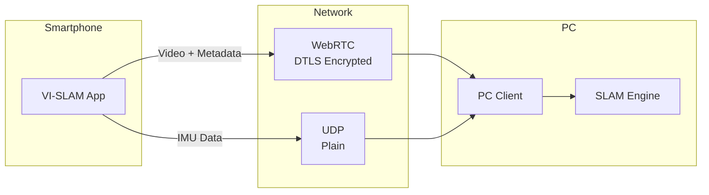

**Security Notes**:
- WebRTC provides DTLS encryption for video and metadata
- UDP IMU stream is unencrypted (performance priority)
- Recommend using on private/trusted networks
- Optional VPN for public network usage

---

## 7. Deployment Architecture

### 7.1 Deployment Diagram

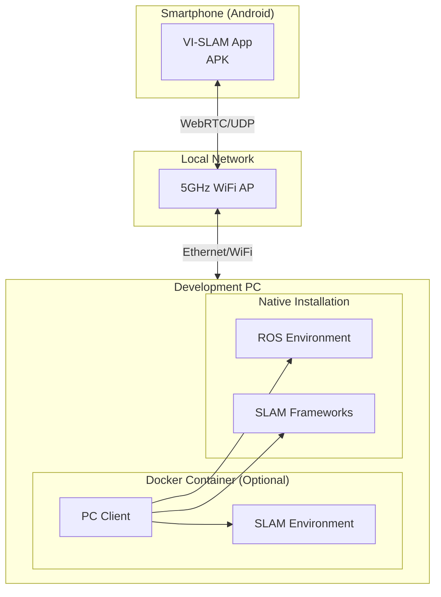

### 7.2 Environment Configuration

| Environment | Purpose | Configuration |
|-------------|---------|---------------|
| Development | Local development | Native installation, debug builds |
| Testing | Automated testing | Docker containers, CI/CD |
| Production | End-user deployment | Native/Docker, optimized builds |

### 7.3 Android App Deployment

**Build Configuration**:
```gradle
android {
    compileSdk 34

    defaultConfig {
        applicationId "com.vislam.app"
        minSdk 26
        targetSdk 34
        versionCode 1
        versionName "1.0.0"
    }

    buildTypes {
        release {
            minifyEnabled true
            proguardFiles getDefaultProguardFile('proguard-android-optimize.txt')
        }
        debug {
            debuggable true
        }
    }
}
```

**Distribution**:
- APK direct download from GitHub Releases
- Google Play Store (future)

### 7.4 PC Client Deployment

#### 7.4.1 Native Installation (Ubuntu)

```bash
# Install dependencies
sudo apt-get update
sudo apt-get install -y \
    build-essential cmake git \
    libopencv-dev libeigen3-dev \
    libceres-dev libsuitesparse-dev \
    python3-pip python3-dev

# Install Python dependencies
pip3 install -r requirements.txt

# Build C++ components
mkdir build && cd build
cmake .. -DCMAKE_BUILD_TYPE=Release
make -j$(nproc)

# Install
sudo make install
```

#### 7.4.2 Docker Deployment

```dockerfile
# Dockerfile
FROM ubuntu:22.04

# Install dependencies
RUN apt-get update && apt-get install -y \
    build-essential cmake git \
    libopencv-dev libeigen3-dev \
    libceres-dev python3-pip

# Copy source
COPY . /app
WORKDIR /app

# Build
RUN mkdir build && cd build && \
    cmake .. -DCMAKE_BUILD_TYPE=Release && \
    make -j$(nproc)

# Install Python dependencies
RUN pip3 install -r requirements.txt

# Entry point
ENTRYPOINT ["./build/vi_slam_client"]
```

```yaml
# docker-compose.yml
version: '3.8'

services:
  vi_slam_client:
    build: .
    network_mode: host
    volumes:
      - ./data:/app/data
      - ./config:/app/config
    environment:
      - DISPLAY=${DISPLAY}
    devices:
      - /dev/dri:/dev/dri  # GPU access for visualization
```

### 7.5 SLAM Framework Installation

#### 7.5.1 VINS-Mono

```bash
# Clone and build
cd ~/catkin_ws/src
git clone https://github.com/HKUST-Aerial-Robotics/VINS-Mono.git
cd ..
catkin_make -DCMAKE_BUILD_TYPE=Release
source devel/setup.bash
```

#### 7.5.2 OpenVINS

```bash
# Clone and build
cd ~/catkin_ws/src
git clone https://github.com/rpng/open_vins.git
cd ..
catkin_make -DCMAKE_BUILD_TYPE=Release
source devel/setup.bash
```

#### 7.5.3 ORB-SLAM3

```bash
# Clone and build
git clone https://github.com/UZ-SLAMLab/ORB_SLAM3.git
cd ORB_SLAM3
chmod +x build.sh
./build.sh
```

#### 7.5.4 Basalt

```bash
# Clone and build
git clone --recursive https://gitlab.com/VladyslavUsenko/basalt.git
cd basalt
./scripts/install_deps.sh
mkdir build && cd build
cmake .. -DCMAKE_BUILD_TYPE=Release
make -j$(nproc)
```

---

## 8. Traceability Matrix

### 8.1 SRS Feature to Component Mapping

| SRS Feature | Component(s) | API Endpoints | Data Entities |
|-------------|--------------|---------------|---------------|
| SF-001 Camera Capture | CMP-001 | - | CameraFrame, FrameMetadata |
| SF-002 IMU Capture | CMP-002 | - | IMUSample |
| SF-003 Timestamp Sync | CMP-003, CMP-008 | - | SynchronizedData |
| SF-004 Local Storage | CMP-005 | - | Session, all entities |
| SF-005 Real-time Streaming | CMP-006, CMP-007 | WebRTC, UDP | - |
| SF-006 PC Data Reception | CMP-007, CMP-008 | WebRTC, UDP | DecodedFrame |
| SF-007 SLAM Integration | CMP-009 | - | Pose, MapPoint |
| SF-008 Calibration | CMP-011 | - | Calibration entities |
| SF-009 Offline Processing | CMP-009 | - | Pose, MapPoint |
| SF-010 Real-time SLAM | CMP-009 | - | Pose |
| SF-011 Output/Export | CMP-010 | ZMQ, ROS | Pose, MapPoint |
| SF-012 Visualization | CMP-012 | - | - |
| SF-013 ROS Integration | CMP-010 | ROS Topics | Pose, MapPoint |
| SF-014 Settings UI | Android UI | - | Config entities |
| SF-015 Status Display | Android UI, PC UI | - | Statistics |

### 8.2 Use Case to Component Mapping

| Use Case | Primary Components | Supporting Components |
|----------|-------------------|----------------------|
| UC-001 Camera Capture | CMP-001 | CMP-003, CMP-004 |
| UC-002 IMU Sampling | CMP-002 | CMP-003, CMP-004 |
| UC-003 Time Alignment | CMP-003 | CMP-001, CMP-002 |
| UC-004 Recording | CMP-005 | CMP-004 |
| UC-005 Streaming | CMP-006 | CMP-004 |
| UC-006 Data Reception | CMP-007 | CMP-008 |
| UC-007 VINS-Mono | CMP-009 (VINSMonoAdapter) | CMP-008, CMP-010 |
| UC-008 Framework Selection | CMP-009 | - |
| UC-009 Intrinsic Calibration | CMP-011 | CMP-001 |
| UC-010 Extrinsic Calibration | CMP-011 | CMP-001, CMP-002, CMP-005 |
| UC-011 Offline Processing | CMP-009 | CMP-010 |
| UC-012 Real-time Pose | CMP-009 | CMP-007, CMP-008, CMP-010 |
| UC-013 Trajectory Export | CMP-010 | CMP-009 |
| UC-014 Pose API | CMP-010 | CMP-009 |
| UC-015 Point Cloud Export | CMP-010 | CMP-009 |
| UC-016 Visualization | CMP-012 | CMP-009 |
| UC-017 ROS Publishing | CMP-010 | CMP-009 |
| UC-018 Configuration | Android Settings UI | - |
| UC-019 Status Monitoring | Android/PC Status UI | All components |

### 8.3 NFR to Design Mapping

| NFR ID | Design Element | Implementation |
|--------|----------------|----------------|
| NFR-P001 (Latency < 100ms) | CMP-006, CMP-007 | WebRTC optimization, buffer tuning |
| NFR-P002 (Accuracy < 0.1m) | CMP-009 | Framework selection, calibration quality |
| NFR-P003 (30 FPS) | CMP-001, CMP-009 | Hardware-level camera, optimized SLAM |
| NFR-P004 (200Hz IMU) | CMP-002 | SENSOR_DELAY_FASTEST |
| NFR-P005 (< 1% drop) | CMP-001, CMP-005 | Double buffering, priority scheduling |
| NFR-R001 (30 min uptime) | All components | Memory management, leak prevention |
| NFR-R002 (95% tracking) | CMP-009 | Relocalization, robust initialization |
| NFR-R003 (Data integrity) | CMP-005 | Checksums, atomic writes |
| NFR-R004 (Auto-reconnect) | CMP-006, CMP-007 | Reconnection logic |
| NFR-S001 (DTLS) | CMP-006 | WebRTC built-in |
| NFR-S002 (App sandbox) | CMP-005 | Android storage API |

---

## 9. Appendix

### 9.1 Design Decisions (ADR)

#### ADR-001: WebRTC for Video Streaming

**Context**: Need to stream video from smartphone to PC with low latency.

**Decision**: Use WebRTC for video streaming.

**Rationale**:
- Built-in H.264/H.265 encoding/decoding
- DTLS encryption included
- NAT traversal support
- Industry standard with mature implementations

**Consequences**:
- Additional complexity for signaling server
- Slightly higher latency than raw UDP
- Better security and reliability

#### ADR-002: Separate UDP for IMU Data

**Context**: IMU data requires very low latency (< 5ms jitter).

**Decision**: Use separate UDP socket for IMU data.

**Rationale**:
- Minimum overhead for small packets
- Independent of video stream congestion
- Predictable latency characteristics

**Consequences**:
- No encryption (acceptable for non-sensitive data)
- Requires separate packet handling
- Potential packet loss (mitigated by high sample rate)

#### ADR-003: Adapter Pattern for SLAM Frameworks

**Context**: Need to support multiple SLAM frameworks with different APIs.

**Decision**: Implement Adapter pattern with `ISLAMFramework` interface.

**Rationale**:
- Uniform interface for all frameworks
- Easy addition of new frameworks
- Framework-specific optimizations hidden behind interface

**Consequences**:
- Additional abstraction layer
- Some framework-specific features may not be exposed
- Easier testing and maintenance

#### ADR-004: Kotlin Coroutines for Android Concurrency

**Context**: Android app requires concurrent sensor capture and streaming.

**Decision**: Use Kotlin Coroutines for concurrency management.

**Rationale**:
- Structured concurrency prevents leaks
- Efficient thread usage
- Clean async code with suspend functions
- Native Kotlin integration

**Consequences**:
- Requires Kotlin knowledge
- Learning curve for callback-based API integration

### 9.2 Open Questions

| ID | Question | Status | Resolution |
|----|----------|--------|------------|
| OQ-001 | Should we support on-device SLAM processing? | Deferred | Phase 3 consideration |
| OQ-002 | Cloud-based SLAM architecture? | Deferred | Phase 3 consideration |
| OQ-003 | Unity/Unreal SDK design? | Open | Requires SDK specification |
| OQ-004 | Multi-camera stereo support? | Future | ORB-SLAM3 stereo capability |
| OQ-005 | Map persistence and loading? | Open | Framework-specific implementation |

### 9.3 Glossary

| Term | Definition |
|------|------------|
| **6DoF** | Six Degrees of Freedom - position (x, y, z) and orientation (roll, pitch, yaw) |
| **Adapter Pattern** | Design pattern that allows incompatible interfaces to work together |
| **ATE** | Absolute Trajectory Error - global consistency metric |
| **Circular Buffer** | Fixed-size buffer that overwrites oldest data when full |
| **DTLS** | Datagram Transport Layer Security - encryption for UDP |
| **Extrinsic** | Spatial relationship between two sensors |
| **ICE** | Interactive Connectivity Establishment - WebRTC connection protocol |
| **Intrinsic** | Internal parameters of a camera (focal length, distortion) |
| **Observer Pattern** | Design pattern where objects subscribe to state changes |
| **SDP** | Session Description Protocol - WebRTC signaling format |
| **WebRTC** | Web Real-Time Communication - peer-to-peer streaming protocol |
| **ZMQ** | ZeroMQ - high-performance messaging library |

### 9.4 Revision History

| Version | Date | Author | Changes |
|---------|------|--------|---------|
| 1.0.0 | 2026-01-24 | VI-SLAM Team | Initial SDS creation |

---

## Approval

| Role | Name | Signature | Date |
|------|------|-----------|------|
| Technical Lead | | | |
| Architect | | | |
| QA Lead | | | |

---

*This Software Design Specification provides the technical design for the VI-SLAM system.*
*Document created: 2026-01-24*
*Version: 1.0.0*
